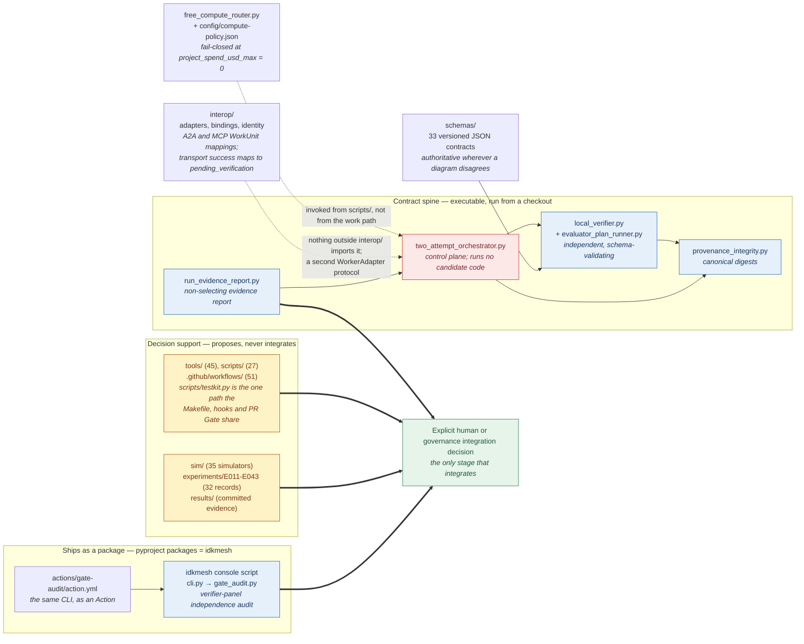

# IDKMesh Architecture

**Status:** current high-level architecture map. Detailed subsystem documents and versioned schemas define the executable contracts; research mechanisms remain experimental unless their evidence gates say otherwise.

IDKMesh is a verification-first coordination system for uncertain, distributed work. The repository currently combines protocol contracts, experiment/simulation code, GitHub-native control loops, community/evolution research, and interoperability adapters. It is **not yet a production distributed mesh or a finished Verified Swarm Runner product**.

For the canonical definitions of event, action, candidate, iteration, generation, learning, improvement, and integration authority, see [`ITERATION_MODEL.md`](ITERATION_MODEL.md).

## 1. System identity

IDKMesh has five coupled roles:

1. **coordination framework and protocol set** — goals, bounded work, evidence, provenance, resources, and authority;
2. **reference application** — the Git-native Verified Swarm Runner;
3. **research program** — experiments about collective intelligence, verification, scheduling, diversity, and governance;
4. **open community** — humans and agents supplying goals, implementation, criticism, review, and stewardship;
5. **self-hosting experiment** — this repository is the first project whose evolution is being modeled by IDKMesh mechanisms.

These roles share one authority rule: **proposal, execution, verification, and canonical integration are distinct stages.**

### What those five roles are, as code on `main`

The prose here and in the sections below describes the system IDKMesh is
becoming. This diagram is narrower on purpose: it is the map of what is
**executable in this repository today**, read off the tree rather than off the
design. Three arrow styles carry three different claims:

| Arrow | Means |
| --- | --- |
| solid | a dependency that exists in the code — one module imports or reads the other |
| thick | produces evidence that reaches the integration decision; **no authority travels along it** |
| dashed | a relationship the prose asserts that has **no import path on `main`** |



**Source:** the tree itself — `pyproject.toml`, `idkmesh/`, `experiments/`,
`interop/`, `schemas/`, `sim/`, `tools/`, `scripts/`,
[`config/compute-policy.json`](config/compute-policy.json) and
`.github/workflows/`. Every count is a measurement of one revision, not a
constant; re-derive rather than trust them.

The two dashed edges, and two more bindings the diagram cannot show, are the
honest part. Each was established by looking for the import, not by reading the
prose:

* **Only `idkmesh/` ships.** `pyproject.toml` sets `packages = ["idkmesh"]` and
  exposes one console script. Everything else above is research and
  repository-operations code that runs from a checkout. §10's "not a finished
  end-user product" is a packaging fact before it is a judgement.
* **`interop/` is not wired into the orchestrator.** No module outside
  `interop/` and `interop/tests/` imports it, and `WorkerAdapter` is defined
  twice — once in `interop/adapters.py`, once in
  `experiments/two_attempt_orchestrator.py`. That is what §4 means by
  "interoperability infrastructure, not production worker integrations": two
  implementations of one boundary that do not yet meet.
* **Compute admission is a separate entry point.** `free_compute_router.py` is
  imported by `scripts/resource_compute_admission.py`,
  `scripts/free_resource_planner.py` and `experiments/local_compute_offer.py` —
  not by the orchestrator. The §5 rule binds wherever admission is invoked; it
  is not enforced *inside* the work path.
* **Two schema bindings are test-time, not runtime.** `interop/` checks WorkUnit
  shape with hand-written validation, and `idkmesh/gate_audit.py` stamps
  `gate-audit-report-v0.1` on its output without loading the schema. Both are
  validated against `schemas/` in the suite, so drift fails a test rather than a
  run.

The contract chain these pieces implement, and who is authoritative at each
step, is §2.


## 2. Canonical work/evidence path

The current semantic boundary is:

<picture>
  <source media="(prefers-color-scheme: dark)" srcset="docs/architecture/diagrams/work-evidence-path-dark.svg">
  
</picture>

The three other core flows — the two-attempt orchestrator state machine,
zero-project-spend compute admission, and the PR gate — are rendered the same
way in [`docs/architecture/PIPELINE_DIAGRAMS.md`](docs/architecture/PIPELINE_DIAGRAMS.md).

Hard separations:

```text
worker success != acceptance
verifier recommendation != merge authority
CI success != independent human approval
benchmark fixture != scientific outcome
```

The machine-readable contracts and compatibility rules live in [`schemas/`](schemas/README.md).

## 3. Semantic state: goals, work, evidence, provenance

IDKMesh models the project as interacting graphs rather than one task queue.

### Goal / knowledge graph

Represents goals, questions, assumptions, hypotheses, requirements, proposals, decisions, risks, and uncertainty.

### Work graph

Represents Work Units, dependencies, decomposition, execution attempts, verification work, documentation work, and integration work.

### Evidence / provenance graph

Binds claims to immutable artifacts, source revisions, worker/verifier identities, checks, results, and decision history.

### Participant / capability graph

Represents humans, agents, tools, and compute resources by capabilities, independence, trust/authority, availability, cost, and resource limits.

The repository's typed graph model and GitHub projection are documented in [`docs/architecture/IDKGRAPH_TASK_AND_EVOLUTION_MODEL.md`](docs/architecture/IDKGRAPH_TASK_AND_EVOLUTION_MODEL.md).

## 4. Worker and interoperability boundary

Coordinator-facing execution should depend on a small protocol-neutral worker interface rather than a specific agent framework.

Current executable interoperability work under [`interop/`](interop/) includes:

- a `WorkerAdapter` protocol;
- a local direct adapter used for deterministic tests/research;
- an A2A lifecycle mock that crosses the same coordinator boundary;
- A2A and MCP WorkUnit mappings;
- canonical completion normalization where transport success still maps to `pending_verification`;
- identity/provenance binding;
- optional SDK/conformance helpers.

This means IDKMesh has **interoperability infrastructure**, not that all external frameworks are production worker integrations today.

The architectural rule is:

> Use A2A/MCP and existing agent/tool ecosystems for transport and execution integration; keep IDKMesh-specific semantics in bounded work, evidence, verification, provenance, scheduling, and governance.

## 5. Execution and resource admission

Execution authority is constrained before work reaches a worker.

Important current boundaries include:

- WorkUnit capability/resource requirements;
- explicit security and permission fields;
- project-level compute policy;
- zero-project-spend admission (`project_spend_usd_max = 0` while the current policy is active);
- provider-neutral compute offers;
- fail-closed behavior when no eligible resource exists;
- separation between capacity discovery/planning and permission to execute.

See [`PROJECT_RULES.md`](PROJECT_RULES.md), [`config/compute-policy.json`](config/compute-policy.json), and the compute architecture documents in [`docs/architecture/`](docs/architecture/README.md).

## 6. Verification architecture

Verification is not a final boolean attached to worker output. It is a separate evidence-producing system.

Current repository mechanisms include:

- schema and cross-object validation;
- deterministic independent validators;
- EvaluatorPlan commitments;
- unified-diff and repository-patch evaluation research;
- provenance integrity checks;
- evidence aggregation with authority ceilings;
- sequential/anytime/adversarial evidence experiments;
- correlation/dependence/quorum simulations;
- non-selecting reporting and replay work.

A worker may claim it succeeded. A verifier may recommend acceptance. Neither actor can use that claim to mutate canonical state by itself.

## 7. Repository evolution and self-hosting

The repository also experiments with making project evolution explicit and measurable.

Current GitHub-native mechanisms include:

- repository state/event observations;
- Bayesian/evolution health signals;
- Pareto/UCB attention allocation;
- conjunctive non-compensation guards;
- CI shadow planning and exact-head outcome evaluation;
- IDKGraph structural/link observability;
- ACE community-growth and capacity experiments;
- protected-main integration gates.

These mechanisms are **decision support and bounded proposal machinery**. Statistical confidence, portfolio rank, community activity, or automated verification cannot promote themselves into merge/governance authority.

See [`ITERATION_MODEL.md`](ITERATION_MODEL.md), [`docs/architecture/SELF_EVOLVING_REPOSITORY.md`](docs/architecture/SELF_EVOLVING_REPOSITORY.md), and the [architecture index](docs/architecture/README.md).

## 8. Research and simulation layer

[`sim/`](sim/) and [`experiments/`](experiments/) contain deterministic simulators, analysis code, fixtures, experiment definitions, and evidence tooling for questions such as:

- diversity vs replication;
- correlated verifier error;
- quorum design;
- verification backpressure;
- scheduling and stigmergy;
- criticality/overload behavior;
- learned verifier reliability;
- decomposition strategy;
- repository/community evolution.

Simulation validates mechanisms and falsifies assumptions cheaply. It does **not** establish real-world performance unless the experiment explicitly uses observed data or real execution.

## 9. Community and governance layer

Community capacity is part of the architecture because human attention, independent review, contributor recurrence, and stewardship are scarce resources.

The system therefore models or records:

- bounded starter work;
- reviewer/maintainer load;
- contribution lineage;
- verified descendants rather than raw activity;
- contributor independence;
- governance and constitutional constraints.

See [`COMMUNITY.md`](COMMUNITY.md), [`COMMUNITY_GROWTH_ENGINE.md`](COMMUNITY_GROWTH_ENGINE.md), [`GOVERNANCE.md`](GOVERNANCE.md), and [`CONSTITUTION.md`](CONSTITUTION.md).

## 10. Current reference-product boundary

The target Verified Swarm Runner is intentionally narrower than the long-term mesh:

```text
bounded Git task
 -> WorkUnit
 -> multiple replaceable attempts
 -> isolated candidate artifacts
 -> independent verification
 -> non-selecting evidence report
 -> explicit human integration
```

Substantial contracts, verification machinery, replay/evidence work, and interoperability code exist. However, the repository should not describe the runner as a finished end-user product until the current real worker/adapter gates are integrated and the documented acceptance criteria are satisfied.

That distinction replaces the older architecture statement that the project merely needed to “start with a single-machine simulation”; the repository has already progressed beyond that stage.

## 11. Scaling principle

Long-term scaling remains a hypothesis to earn through evidence.

The current direction is hierarchical/federated locality:

```text
node -> cell -> region/fabric -> federation
```

Higher levels should exchange summaries, overflow work, discovery, attestations, and protocol metadata rather than centralizing all participant state.

Before wider deployment, experiments must address churn, partitions, heterogeneous environments, resource accounting, malicious/corrupted results, sandbox strength, artifact transfer, and governance across trust domains.

See [`docs/architecture/SCALABILITY_AND_AGILITY.md`](docs/architecture/SCALABILITY_AND_AGILITY.md).

## 12. Where to look next

- [`schemas/README.md`](schemas/README.md) — executable contracts and versioning.
- [`docs/architecture/README.md`](docs/architecture/README.md) — subsystem architecture index.
- [`docs/specifications/README.md`](docs/specifications/README.md) — versioned specifications.
- [`docs/research/README.md`](docs/research/README.md) — experiment/evidence navigation.
- [`EVOLUTION.md`](EVOLUTION.md) — strategy and next evidence gates.
- [`ROADMAP.md`](ROADMAP.md) — staged progression from the current state.
- [`PROJECT_RULES.md`](PROJECT_RULES.md) — repository-wide constraints and public-record rules.
