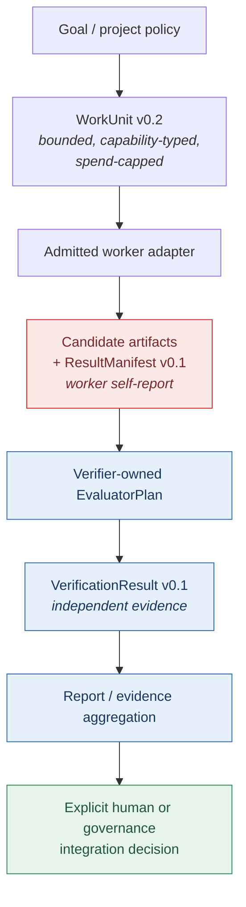
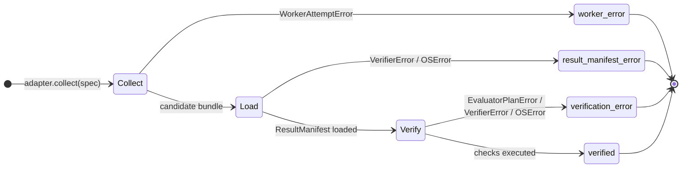
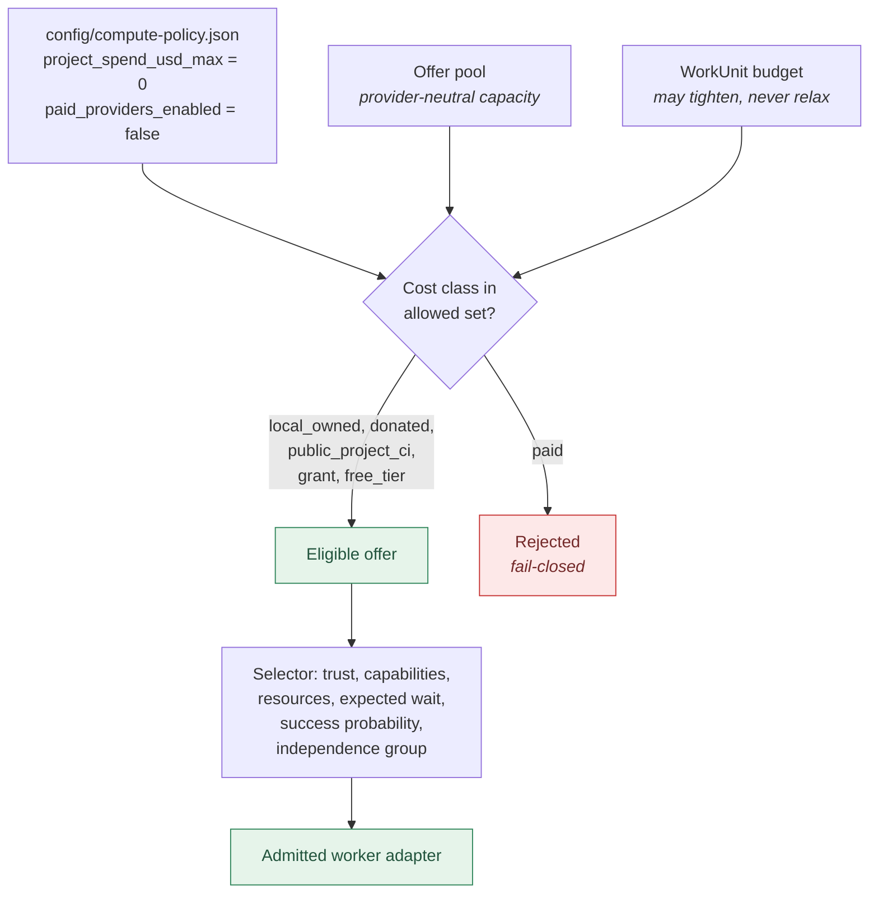
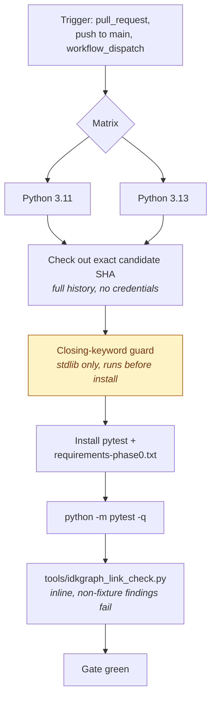

# Pipeline Diagrams

**Status:** current rendered view of pipelines that are already specified in
prose elsewhere. This document adds no new contract. Where a diagram and a
schema disagree, the schema in [`../../schemas/`](../../schemas/README.md) is
authoritative.

Every flow below was read off the executable code named in its "Source" line,
not off a design sketch. The diagrams use Mermaid, which GitHub renders
natively, so the control flow is legible without reconstructing it from ASCII
blocks.

## 1. Canonical work and evidence path

This is the semantic boundary described in
[`../../ARCHITECTURE.md`](../../ARCHITECTURE.md) §2. The critical property is
that authority is *not* transferred along the arrows: each stage produces
evidence for the next, and only the final stage integrates.

**Source:** `experiments/two_attempt_orchestrator.py`,
`schemas/work-unit-v0.2.schema.json`, `schemas/result-manifest-v0.1.schema.json`,
`schemas/verification-result-v0.1.schema.json`.



The hard separations this diagram encodes:

| Not equal to | | |
| --- | --- | --- |
| worker success | ≠ | acceptance |
| verifier recommendation | ≠ | merge authority |
| CI success | ≠ | independent human approval |
| benchmark fixture | ≠ | scientific outcome |

## 2. Two-attempt orchestrator state machine

The orchestrator is a **control-plane MVP, not a worker runtime**. It executes
no candidate code. Each attempt independently reaches exactly one of four
terminal states, and a failure in one attempt does not abort the others —
that isolation is the property the two-attempt design exists to exercise.

**Source:** `orchestrate()` in `experiments/two_attempt_orchestrator.py`.



The three error states are counted together as `control_failures`, which sets
the run to `completed_with_failures`. Only the `verified` state carries a
`recommendation`, which is `accept_candidate` or `reject_candidate`.

Verification control is selected per run and is backward compatible: a run uses
either one canonical `EvaluatorPlan` or a legacy verifier policy, never both.

Every run report declares the same authority block, and all four values are
constant:

```json
"authority": {
  "canonical_state_write": false,
  "git_push": false,
  "merge": false,
  "automatic_candidate_selection": false
}
```

A verified, accepted candidate therefore still changes nothing on its own.

## 3. Zero-project-spend compute admission

Repository policy is applied **first** and acts as a hard ceiling. A WorkUnit
may tighten the spend constraint but can never relax it, so the policy check
cannot be bypassed by a task that asks for more authority than the project has.

**Source:** `config/compute-policy.json`,
`schemas/compute-policy-v0.1.schema.json`,
`schemas/compute-offer-pool-v0.1.schema.json`,
`experiments/local_compute_offer.py`.



`paid` exists in the offer schema for interoperability and testing only; it is
disabled by repository policy. Donated capacity must additionally be opt-in
(`donor_costs_must_be_opt_in`), and must stay voluntary, visible, capped, and
easy to stop.

## 4. PR Gate

Every other workflow in the repository is path-filtered, so none of them runs
on every pull request. PR Gate is deliberately unfiltered so it can serve as
the one stable required check on `main` — a required check that never runs
would leave a pull request permanently blocked, which is the unrecoverable
deadlock issue #35 warns about.

**Source:** `.github/workflows/pr-gate.yml`.



The closing-keyword guard runs **before** the dependency install so an
accidental issue auto-closure fails fast; it is pure standard library and needs
no packages. Untrusted pull request title and body text reach the guard through
the environment and `argv` only, never through the shell as code.

The link check runs `tools/idkgraph_link_check.py` inline and fails on any
finding whose source path is outside `tests/fixtures/`. Negative link fixtures
are seeded there deliberately, so excluding them is what lets the gate assert
"no *new* broken link" rather than "no broken link anywhere".

## Related documents

- [`../../ARCHITECTURE.md`](../../ARCHITECTURE.md) — the prose architecture map
  these diagrams render.
- [`../../ITERATION_MODEL.md`](../../ITERATION_MODEL.md) — canonical event,
  action, iteration, and authority vocabulary.
- [`../../schemas/README.md`](../../schemas/README.md) — the machine-readable
  contracts that remain authoritative.
