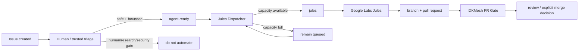

# Jules development automation

IDKMesh uses Google Jules as a **bounded implementation worker**, not as an
integration authority. The automation is designed to keep small coding work
moving quickly while preserving the repository's existing verification and
human-governance boundaries.

## One-sentence operating model

**Single-dispatcher invariant:** the native Google Labs Jules GitHub App path described here is the only project-operated Jules dispatcher. Do not run a second REST-API dispatcher, a second queue label, or another workflow that creates Jules sessions for the same repository at the same time. A second lane must first replace this one through an explicit migration, not coexist with it.

A maintainer or trusted triager marks a reviewed issue `agent-ready`; GitHub
Actions immediately adds `jules` when capacity is available; the Google Labs
Jules GitHub App starts the coding task; Jules opens a pull request; normal
IDKMesh CI and review decide whether the candidate can be integrated.



The external provider behavior behind the `jules` label is documented by
Google at <https://jules.google/docs/running-tasks/>.

## Who does what

| Actor | Responsibility | Must not do |
| --- | --- | --- |
| issue author / contributor | describe a bounded problem and acceptance criteria | self-declare human evidence as satisfied |
| maintainer / trusted triager | decide whether the issue is safe and bounded; add `agent-ready` | add it to human-only, research-evidence, or security-sensitive work |
| Jules Dispatcher GitHub Action | create policy labels, enforce deny labels/capacity, add `jules` | infer safety from arbitrary issue prose or merge code |
| Google Labs Jules GitHub App | react to `jules`, implement the task, create a PR | act as independent verifier or integration authority |
| IDKMesh CI | test the exact PR candidate | decide scientific validity or governance approval |
| maintainer / reviewer | review evidence and decide integration | treat agent output as self-validating |

## Trigger frequency

There are two paths.

**Fast path — event driven.** When `agent-ready` is applied, the
`.github/workflows/jules-dispatch.yml` workflow runs immediately. If a slot is
available and no veto label exists, it adds `jules` in that run. There is no
polling delay in the normal path.

**Capacity-release path — event driven.** When an open dispatched issue closes
(for example after its Jules PR merges with an issue-closing reference), the
workflow runs again and immediately fills newly available capacity from the
remaining `agent-ready` queue. Development therefore does not normally wait
for the recovery schedule after a completed task.

**Recovery path — every 30 minutes.** At minutes 17 and 47 UTC, the same
workflow rescans the queue. This catches an issue that was left waiting because
capacity was full or an earlier workflow run was interrupted. GitHub Actions
scheduled runs are best-effort and can be delayed by the platform, so the
scheduled sweep is a reliability mechanism, not the primary dispatch mechanism.

The workflow also runs after its own policy/implementation files land on
`main`, and it supports manual `workflow_dispatch` for maintainers.

## Queue and concurrency policy

The machine-readable policy is
[`../../config/jules-dispatch.json`](../../config/jules-dispatch.json).

Current defaults:

- maximum open dispatched issues: **4**;
- maximum dispatches per recovery sweep: **2**;
- an `agent-ready` label event dispatches at most **1** issue immediately;
- closing a dispatched issue immediately triggers a capacity refill;
- open issues already carrying `jules` consume capacity until they close or the
  label is deliberately removed.

Four concurrent issue slots are a repository-side review/backpressure choice,
not a claim about a provider plan limit. Change the number only after measuring
review latency and CI/merge load.

## Label contract

### Execution labels

| Label | Meaning |
| --- | --- |
| `agent-ready` | a trusted triager has reviewed the issue as bounded and safe for a coding agent |
| `jules` | execution signal; normally added by the dispatcher, not by semantic classification |

The separation matters: classifying an issue as agent-suitable is different
from starting work right now.

### Hard veto labels

Any of these prevents automatic dispatch even if `agent-ready` is present:

- `blocked`;
- `do-not-automate`;
- `human-required`;
- `needs-decomposition`;
- `research-evidence`;
- `security-sensitive`.

The dispatcher fails closed on these labels.

### Scheduling labels

Priority weights:

- `priority:p0` — highest;
- `priority:p1` — high;
- `priority:p2` — normal.

Size weights:

- `size:xs`;
- `size:s`;
- `size:m`.

Within the recovery queue, higher priority wins. For equal priority, smaller
bounded work receives a small preference. `bug`, `good first issue`, and
`documentation` receive small tie-breaking bonuses. The issue that just
received `agent-ready` is attempted first on the event-driven path.

## Triage checklist before `agent-ready`

Use `agent-ready` only when all of these are true:

1. the deliverable is concrete and can fit in one focused PR;
2. acceptance criteria are observable;
3. normal repository tests/CI can verify a meaningful part of the result;
4. the issue does not require a genuine new-human observation;
5. the issue does not require independent research/evidence collection;
6. it is not a security approval, governance decision, secret-management task,
   or broad architecture redesign;
7. the issue body contains no credentials/private data;
8. the prompt is resistant to ambiguity: allowed files/scope, required tests,
   and stop conditions are stated.

Good automatic tasks include small bugs, focused tests, deterministic tooling,
narrow documentation/code consistency fixes, and bounded refactors.

Do **not** auto-dispatch external-machine evidence collection, newcomer
observation, independent audits, research conclusions, security approvals, or
large roadmap/architecture work.

## Speed without flooding review

For development throughput, keep a ready queue of small tasks rather than
raising concurrency first.

Recommended operating rhythm:

1. keep several `size:xs` / `size:s` issues fully specified;
2. apply `priority:p0` or `priority:p1` only where ordering matters;
3. mark the next safe tasks `agent-ready`;
4. let the event workflow fill the four slots;
5. review/merge/close completed PRs promptly so slots free automatically;
6. decompose broad work with `needs-decomposition` instead of sending a vague
   prompt to an agent.

This gives parallel development while keeping review backpressure explicit.

## What happens after Jules starts

The native Jules GitHub integration comments on the issue when it accepts a
`jules` task and later links the created PR. Jules also currently supports
automatic repair attempts for CI failures on PRs it creates; that provider
feature does not replace IDKMesh's required checks or reviewer judgment.

The repository PR gate remains authoritative for automated integration checks:

- required Python versions;
- unit/integration behavior;
- deterministic link checks;
- existing schema/workflow invariants.

No Jules task auto-merges `main`.

## Failure and recovery runbook

### `agent-ready` exists but `jules` does not

1. check the Jules Dispatcher Actions run;
2. check whether four open `jules` issues already consume capacity;
3. check for a hard-veto label;
4. wait for the next 30-minute recovery sweep or manually run the workflow.

### `jules` exists but Jules does not acknowledge the issue

1. verify the Google Labs Jules GitHub App still has access to `MSKazemi/idkmesh`;
2. inspect the provider/task status;
3. do **not** repeatedly remove/re-add `jules` while task state is unclear;
4. if the provider task is definitively failed, remove `jules`, add `blocked`
   (or another accurate veto), document the blocker, and re-triage before retry.

### Jules creates a failing PR

Let normal CI expose the failure. Provider-side CI repair may update the PR.
The exact final head still has to pass repository checks. Never weaken tests
merely to make an agent PR green.

### Too many PRs waiting for review

Stop adding `agent-ready`, or lower `max_in_flight` in the policy. Generation
speed is not useful if verification becomes the bottleneck.

## Implementation surfaces

- workflow: [`.github/workflows/jules-dispatch.yml`](../../.github/workflows/jules-dispatch.yml)
- policy: [`config/jules-dispatch.json`](../../config/jules-dispatch.json)
- dispatcher: [`tools/jules_dispatcher.py`](../../tools/jules_dispatcher.py)
- tests: [`tests/test_jules_dispatcher.py`](../../tests/test_jules_dispatcher.py)
- agent instructions: [`AGENTS.md`](../../AGENTS.md)

## Changing the policy

Policy changes go through a normal PR. At minimum:

```bash
python -m pytest -q tests/test_jules_dispatcher.py
python scripts/check_links.py
make gate
```

For changes that alter GitHub permissions, triggers, or the approval boundary,
review the security implications explicitly. Keep `issues: write` scoped to the
dispatcher workflow; the workflow checks out the trusted default branch and
uses issue text only as inert metadata, never as shell/code input.
