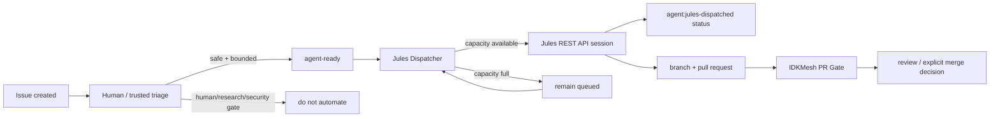

# Jules development automation

IDKMesh uses Google Jules as a **bounded implementation worker**, not as an
integration authority. The automation is designed to keep small coding work
moving quickly while preserving the repository's existing verification and
human-governance boundaries.

## One-sentence operating model

**Single-dispatcher invariant:** the REST-API path described here is the only project-operated automatic Jules dispatcher. Do not run a second API dispatcher, another queue, or another workflow that creates Jules sessions for the same repository at the same time. The legacy native GitHub App `jules` label is retained only as an explicit manual fallback and is never emitted by the automatic dispatcher.

The deterministic issue router automatically marks low-risk bounded T1/T2 work `agent:jules-eligible`. Automatic dispatch from that label is accepted only for issues whose GitHub `author_association` is `OWNER`, `MEMBER`, or `COLLABORATOR`, preventing untrusted public issue authors from consuming Jules capacity. Maintainers may explicitly approve any reviewed task with `agent-ready`. GitHub Actions resolves the connected repository through the official Jules Sources API, creates one Jules session with `AUTO_CREATE_PR`, and records `agent:jules-dispatched`; Jules opens a pull request; normal IDKMesh CI and review decide whether the candidate can be integrated.



The automatic provider path uses the Jules REST API documented at
<https://jules.google/docs/api/reference/>. The dispatcher discovers the
connected repository through the Sources API, creates a Session, and requests
`AUTO_CREATE_PR`. The REST API is currently alpha, so provider-contract changes
must be treated as an external compatibility risk.

## Who does what

| Actor | Responsibility | Must not do |
| --- | --- | --- |
| issue author / contributor | describe a bounded problem and acceptance criteria | self-declare human evidence as satisfied |
| maintainer / trusted triager | decide whether the issue is safe and bounded; add `agent-ready` | add it to human-only, research-evidence, or security-sensitive work |
| Jules Dispatcher GitHub Action | enforce deny labels/capacity, create one Jules API session, record `agent:jules-dispatched` | infer safety from arbitrary issue prose, expose the API key, or merge code |
| Google Jules REST API / worker | execute the approved bounded task and create a PR | act as independent verifier or integration authority |
| IDKMesh CI | test the exact PR candidate | decide scientific validity or governance approval |
| maintainer / reviewer | review evidence and decide integration | treat agent output as self-validating |

## One-time owner setup

Automatic dispatch requires two provider-side prerequisites:

1. connect `MSKazemi/idkmesh` to Jules through the Jules web app/GitHub App;
2. create a Jules API key in Jules settings and store it only as the repository
   Actions secret `JULES_API_KEY`.

The dispatcher never prints the key and the key must not be committed, pasted
into issues/PRs, or stored in ordinary repository variables. Idle recovery runs
do not require the key: they can inspect capacity and conclude that no work is
eligible without contacting Jules. If approved work actually reaches the
provider boundary while the secret is missing, dispatch fails closed with an
explicit error rather than silently falling back to the unreliable bot-applied
`jules` label path.

The official authentication guide is
<https://jules.google/docs/api/reference/authentication/>.

## Trigger frequency

There are two paths.

**Fast path — event driven.** When a new/edited/reopened issue is routed to `agent:jules-eligible`, the router explicitly wakes the dispatcher with that issue number. When `agent-ready` is applied manually, the dispatcher runs from the label event. If a slot is
available and no veto label exists, it resolves the Jules source, checks for an
existing deterministic session title, reserves the issue with
`agent:jules-dispatched`, and creates the Jules session. There is no polling
delay in the normal path.

**Capacity-release path — event driven.** When an open dispatched issue closes
(for example after its Jules PR merges with an issue-closing reference), the
workflow runs again and immediately fills newly available capacity from the
remaining `agent-ready` queue. Development therefore does not normally wait
for the recovery schedule after a completed task.

**Recovery path — every 30 minutes.** At minutes 17 and 47 UTC, the same
workflow rescans the queue. In addition, the issue router backfills all open issues every six hours at minute 7 without starting a second redundant dispatcher run. This catches an issue that was left waiting because
capacity was full or an earlier workflow run was interrupted. GitHub Actions
scheduled runs are best-effort and can be delayed by the platform, so the
scheduled sweep is a reliability mechanism, not the primary dispatch mechanism.

The workflow also runs after its own policy/implementation files land on
`main`, and it supports manual `workflow_dispatch` for maintainers.

## Queue and concurrency policy

The machine-readable policy is
[`../../config/jules-dispatch.json`](../../config/jules-dispatch.json).

Current defaults:

- maximum open dispatched issues: **4**;
- maximum dispatches per recovery sweep: **2**;
- automatic dispatch pauses when queued Actions runs exceed **96**;
- automatic dispatch pauses when in-progress Actions runs exceed **24**;
- an `agent-ready` label event dispatches at most **1** issue immediately;
- closing a dispatched issue immediately triggers a capacity refill;
- open issues carrying `agent:jules-dispatched` consume capacity until they
  close or the status is deliberately cleared after investigation;
- legacy/manual open issues carrying `jules` also consume capacity during the
  migration so old work is not double-dispatched.

Four concurrent issue slots are a repository-side review/backpressure choice,
not a claim about a provider plan limit. Change the number only after measuring
review latency and CI/merge load.

The Actions ceilings are an independent fail-closed backpressure gate. Counts
exactly at the configured ceilings remain eligible; exceeding either ceiling
pauses new Jules session creation until the normal recovery sweep sees capacity
again. If the dispatcher cannot read GitHub Actions capacity, it starts no new
provider work.

## Label contract

### Execution labels

| Label | Meaning |
| --- | --- |
| `agent-ready` | explicit maintainer approval for bounded coding-agent execution |
| `agent:jules-eligible` | deterministic low-risk T1/T2 route; enters the automatic queue only for trusted repository-associated authors |
| `agent:jules-dispatched` | automatic dispatcher reservation/status for an API-backed Jules session |
| `jules` | legacy/manual native-App trigger; never added by automatic dispatch |

The separation matters: classifying an issue as agent-suitable is different
from starting work right now.

### Hard veto labels

Any of these prevents automatic dispatch even if `agent-ready` is present:

- `blocked`;
- `do-not-automate`;
- `human-required`;
- `needs-decomposition`;
- `research-evidence`;
- `security-sensitive`.

The dispatcher fails closed on these labels.

### Scheduling labels

Priority weights:

- `priority:p0` — highest;
- `priority:p1` — high;
- `priority:p2` — normal.

Size weights:

- `size:xs`;
- `size:s`;
- `size:m`.

Within the recovery queue, higher priority wins. For equal priority, smaller
bounded work receives a small preference. `bug`, `good first issue`, and
`documentation` receive small tie-breaking bonuses. The issue that just
received `agent-ready` is attempted first on the event-driven path.

## Triage checklist before `agent-ready`

Use `agent-ready` only when all of these are true:

1. the deliverable is concrete and can fit in one focused PR;
2. acceptance criteria are observable;
3. normal repository tests/CI can verify a meaningful part of the result;
4. the issue does not require a genuine new-human observation;
5. the issue does not require independent research/evidence collection;
6. it is not a security approval, governance decision, secret-management task,
   or broad architecture redesign;
7. the issue body contains no credentials/private data;
8. the prompt is resistant to ambiguity: allowed files/scope, required tests,
   and stop conditions are stated.

Good automatic tasks include small bugs, focused tests, deterministic tooling,
narrow documentation/code consistency fixes, and bounded refactors.

Do **not** auto-dispatch external-machine evidence collection, newcomer
observation, independent audits, research conclusions, security approvals, or
large roadmap/architecture work.

## Speed without flooding review

For development throughput, keep a ready queue of small tasks rather than
raising concurrency first.

Recommended operating rhythm:

1. keep several `size:xs` / `size:s` issues fully specified;
2. apply `priority:p0` or `priority:p1` only where ordering matters;
3. mark the next safe tasks `agent-ready`;
4. let the event workflow fill the four slots;
5. review/merge/close completed PRs promptly so slots free automatically;
6. decompose broad work with `needs-decomposition` instead of sending a vague
   prompt to an agent.

This gives parallel development while keeping review backpressure explicit.

## What happens after Jules starts

The dispatcher comments on the issue with the returned Jules session URL/name.
Sessions are created with `automationMode: AUTO_CREATE_PR`, so Jules can open a
pull request without the GitHub Actions workflow receiving pull-request write
permission. Jules provider-side repair behavior does not replace IDKMesh's
required checks or reviewer judgment.

The repository PR gate remains authoritative for automated integration checks:

- required Python versions;
- unit/integration behavior;
- deterministic link checks;
- existing schema/workflow invariants.

No Jules task auto-merges `main`.

## Failure and recovery runbook

### Jules health check

Maintainers can confirm that unattended Jules dispatch is working from the repository side by checking these indicators:

1. **Workflow run history:** Inspect the latest `Jules Dispatcher` workflow run in repository Actions history ([`.github/workflows/jules-dispatch.yml`](../../.github/workflows/jules-dispatch.yml)) to confirm execution status and logs.
2. **Issue status:** Check that the dispatcher applies `agent:jules-dispatched` to mark a started task.
3. **Session comment:** Confirm that the dispatcher posts an issue comment containing the Jules session reference.
4. **CI and review boundary:** Remember that normal IDKMesh CI, test gates, and human code review still apply to all generated pull requests.

### GitHub API quota is exhausted

The dispatcher treats installation rate-limit exhaustion as a transient,
fail-closed condition: it starts no provider work, exits cleanly, and leaves the
issue queued for the next recovery sweep. Routine dispatch no longer lists
labels on every run, and it loads open issues once for both queue selection and
capacity accounting. The issue router also avoids per-issue label reads and
does not run its pytest suite on every issue event.

If quota exhaustion repeats after these reductions, inspect repository-wide
workflow fan-out separately; Jules should not be given a broad personal token
just to bypass a CI design problem.

Managed routing/Jules labels are bootstrapped only on an explicit manual
workflow dispatch using the `bootstrap_labels` input. Normal issue events
assume the repository setup has already created them.

### `agent-ready` exists but `agent:jules-dispatched` does not

1. check the Jules Dispatcher Actions run;
2. verify the `JULES_API_KEY` Actions secret exists and is valid;
3. verify Jules Sources lists `MSKazemi/idkmesh`;
4. check whether four open automatic/legacy Jules issues already consume capacity;
5. check for a hard-veto label;
6. wait for the next 30-minute recovery sweep or manually run the workflow.

### `agent:jules-dispatched` exists but no session/PR appears

A returned 4xx from session creation removes the reservation so a corrected run
can retry. A network error or provider 5xx is ambiguous: Jules may have accepted
the POST before the response was lost. In that case the dispatcher deliberately
keeps `agent:jules-dispatched` and comments on the issue to prevent duplicate
automatic work. Inspect Jules sessions before clearing the status and retrying.

### Manual fallback with `jules`

Use the legacy `jules` label only as an explicit owner action when the API lane
is deliberately disabled or being repaired. Do not have automation add this
label: the live repository showed that Jules did not reliably react when
`github-actions[bot]` applied it.

### Jules creates a failing PR

Let normal CI expose the failure. Provider-side CI repair may update the PR.
The exact final head still has to pass repository checks. Never weaken tests
merely to make an agent PR green.

### Too many PRs waiting for review

Stop adding `agent-ready`, or lower `max_in_flight` in the policy. Generation
speed is not useful if verification becomes the bottleneck.

## Implementation surfaces

- workflow: [`.github/workflows/jules-dispatch.yml`](../../.github/workflows/jules-dispatch.yml)
- policy: [`config/jules-dispatch.json`](../../config/jules-dispatch.json)
- dispatcher: [`tools/jules_dispatcher.py`](../../tools/jules_dispatcher.py)
- tests: [`tests/test_jules_dispatcher.py`](../../tests/test_jules_dispatcher.py)
- agent instructions: [`AGENTS.md`](../../AGENTS.md)

## Changing the policy

Policy changes go through a normal PR. At minimum:

```bash
python -m pytest -q tests/test_jules_dispatcher.py
python scripts/check_links.py
make gate
```

For changes that alter GitHub permissions, triggers, the Jules API contract, or
the approval boundary, review the security implications explicitly. Keep
`issues: write` scoped to the dispatcher workflow; the workflow checks out the
trusted default branch and sends approved issue text only as API data, never as
shell/code input. Never echo or persist `JULES_API_KEY`.
