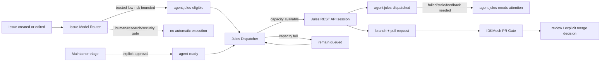

# Jules development automation

IDKMesh uses Google Jules as a **bounded implementation worker**, not as an
integration authority. The automation is designed to keep small coding work
moving quickly while preserving the repository's existing verification and
human-governance boundaries.

## One-sentence operating model

**Single-dispatcher invariant:** the REST-API path described here is the only
project-operated automatic Jules dispatcher. Do not run a second API dispatcher
for the same repository. The legacy native GitHub App `jules` label is retained
only as an explicit manual fallback and is never emitted by the automatic
dispatcher.

There are two trusted ingress paths:

1. **automatic route:** the deterministic Issue Model Router classifies a
   low-risk bounded issue as `agent:jules-eligible`; the dispatcher accepts that
   label only when GitHub reports the issue author association as
   `OWNER`, `MEMBER`, or `COLLABORATOR`;
2. **manual route:** a maintainer/trusted triager adds `agent-ready`, which is
   an explicit human approval and does not depend on the issue author's
   association.

Both paths converge on the same guarded Jules REST API session with
`AUTO_CREATE_PR`, then normal IDKMesh CI/review remains the integration
authority.



The automatic provider path uses the Jules REST API documented at
<https://jules.google/docs/api/reference/>. Sessions are created with
`requirePlanApproval: false` and `automationMode: AUTO_CREATE_PR`. Jules'
documented session states include `QUEUED`, `PLANNING`,
`AWAITING_PLAN_APPROVAL`, `AWAITING_USER_FEEDBACK`, `IN_PROGRESS`,
`PAUSED`, `FAILED`, and `COMPLETED`. The API is currently alpha, so
provider-contract changes remain an external compatibility risk.

## Who does what

| Actor | Responsibility | Must not do |
| --- | --- | --- |
| issue author / contributor | describe a bounded problem and acceptance criteria | self-declare human evidence as satisfied |
| Issue Model Router | classify capability/authority and emit `agent:jules-eligible` only for the configured low-risk lane | grant merge authority or bypass the dispatcher's trusted-author/veto checks |
| maintainer / trusted triager | manually approve a bounded task with `agent-ready`; inspect attention states | add approval to human-only, research-evidence, or security-sensitive work |
| Jules Dispatcher GitHub Action | enforce trust/veto/capacity policy, reconcile provider sessions, create one Jules API session, record repository status | infer safety from arbitrary prose, expose the API key, silently duplicate a session, or merge code |
| Google Jules REST API / worker | execute approved bounded work and create a PR | act as independent verifier or integration authority |
| IDKMesh CI | test the exact PR candidate | decide scientific validity or governance approval |
| maintainer / reviewer | review evidence and decide integration | treat agent output as self-validating |

## One-time owner setup

Automatic dispatch requires two provider-side prerequisites:

1. connect `MSKazemi/idkmesh` to Jules through the Jules web app/GitHub App;
2. create a Jules API key in Jules settings and store it only as the repository
   Actions secret `JULES_API_KEY`.

The dispatcher never prints the key and the key must not be committed, pasted
into issues/PRs, or stored in ordinary repository variables. If the secret is
missing, live dispatch fails closed with an explicit error rather than silently
falling back to the unreliable bot-applied `jules` label path.

The official authentication guide is
<https://jules.google/docs/api/reference/authentication/>.

## Trigger frequency

The system is event-first; schedules are recovery mechanisms.

**Automatic fast path — event driven.** The Issue Model Router runs when an
issue is opened, edited, or reopened. When its deterministic policy emits
`agent:jules-eligible`, the router calls `jules-dispatch.yml` as a local reusable
workflow and passes the typed `workflow_call.issue_number` input. GitHub validates
that caller/callee input contract before execution, so removing or renaming the
input breaks CI instead of silently disconnecting Jules. This explicit handoff
also avoids relying on recursive workflow
starts caused by mutations made with `GITHUB_TOKEN`.

**Manual fast path — event driven.** Adding `agent-ready` directly triggers
the Jules Dispatcher. The newly approved issue is prioritized and at most one
task is started by that event.

**Capacity-release paths — event driven.** Closing an open dispatched issue
immediately invokes reconciliation and fills newly available capacity. A
successful `PR Gate` workflow completion also wakes the dispatcher to re-check
the same live provider, repository and Actions budgets: the gate's matrix jobs
have just left the active set, so a slot freed by verification is reclaimed
within minutes instead of at the next half-hourly tick. This reserves nothing
and bypasses no cap — if queued runs are still above 12 or in-progress runs are
still above 8, the recovery attempt exits without starting Jules work. Failed
and cancelled `PR Gate` runs do not start it at all.

This wake-up is a latency optimization, never a guarantee, and nothing should be
built on its arrival. It is silently skipped whenever there is no successful
`PR Gate` completion to observe: a run cancelled by a newer push to the same pull
request, a commit that reaches `main` with no gate result at all, and a wake-up
dropped while pending because the shared `jules-dispatch` concurrency group
already held a newer one. Because `PR Gate` also runs on pushes to `main`, a
merge touching the control-plane files additionally produces a router backfill
and this wake-up for the same event; the concurrency group serializes them and
the second sweep is a no-op reconcile. Every skipped or collapsed wake-up
degrades to the 30-minute schedule below, which remains the recovery path of
record.

**Recovery/reconciliation path — every 30 minutes.** At minutes 17 and 47 UTC,
the dispatcher checks provider session state, quarantines failed/stale work,
and fills free slots. GitHub scheduled runs are best-effort and may be delayed,
so this is not the primary path.

The Issue Model Router also has a slower backfill schedule for reclassification.
A push to the Jules/router control-plane files on `main` triggers one immediate
full open-issue reclassification and then one reusable dispatcher call with
`bootstrap_labels: true` and `fill_capacity: true`. Reusable workflows inherit
the caller's event context, so capacity-fill intent is passed as a typed input
instead of inferred from `github.event_name`. This lets a repaired or changed
contract refill capacity immediately without waiting for the next six-hour
backfill window or starting a duplicate direct dispatcher.
Manual `workflow_dispatch` remains available for operators, including an
optional `issue_number` and an explicit `bootstrap_labels` control.

## Queue and concurrency policy

The machine-readable policy is
[`../../config/jules-dispatch.json`](../../config/jules-dispatch.json).

Current defaults:

- repository review/backpressure cap (`max_in_flight`): **4** unresolved Jules review reservations;
- Jules provider concurrency cap (`provider_concurrency.max_concurrent_tasks`): **3** concurrent tasks for the configured `Jules` plan, checked 2026-09-23 against the official limits page;
- provider occupancy: account-wide sessions whose state is not terminal; current terminal states are `COMPLETED` and `FAILED`, checked against the official Jules API type reference;
- new dispatch capacity: the smaller of remaining repository slots and remaining provider slots, not the smaller of the two raw limits minus one shared counter;
- GitHub Actions backpressure: **enabled**; new Jules dispatch pauses when repository-wide queued runs exceed **12** or in-progress runs exceed **8**;
- thresholds are strict `>` checks, so counts exactly at 12 queued / 8 in-progress remain admissible;
- maximum new dispatches per recovery sweep: **2**;
- event-driven dispatch starts at most **1** routed/approved issue immediately;
- one GitHub open-issue snapshot is reused for capacity and candidate selection;
- one Jules session-list snapshot is reused for reconciliation and duplicate
  detection within a run;
- provider session history is scanned in pages of 100, up to **10 pages**; if history still has a next page, dispatch fails closed rather than deduplicating against an incomplete view;
- legacy/manual open issues carrying `jules` still consume capacity during
  migration so old work is not double-dispatched.

`max_in_flight` is a repository review/backpressure limit, while
`provider_concurrency.max_concurrent_tasks` records the current provider/account
ceiling separately. They are budgeted independently. Repository availability is
`max_in_flight - unresolved review reservations`; provider availability is
`max_concurrent_tasks - non-terminal account sessions`; dispatch uses the
smaller remaining budget. The provider session list is account-wide, so tasks
started outside IDKMesh also consume the provider budget.

A `COMPLETED` Jules session no longer consumes **provider concurrency**, but
its **repository review** reservation remains while any Jules output PR is still
open. Reconciliation fetches the full Session, reads
`outputs[].pullRequest.url`, binds each URL back to the same repository, and
checks GitHub PR state. Once all Jules output PRs are closed/merged, the
dispatcher replaces `agent:jules-dispatched` with `agent:jules-completed`
and releases the review slot even if the broader parent issue intentionally
stays open. `agent:jules-completed` is a hard redispatch veto until a
maintainer explicitly re-triages the issue for a new bounded attempt.

A completed Session with no usable PR output fails closed to
`agent:jules-needs-attention` rather than silently freeing capacity or starting
a duplicate task. `FAILED` is terminal for provider-capacity accounting;
reconciliation separately moves failed/stalled repository work to
`agent:jules-needs-attention` and removes its dispatch reservation. All other
current Jules states—including queued, planning, in-progress,
feedback/approval waits, paused, and unspecified—are conservatively treated as
provider-active.

The official Jules Session type documents output pull requests at
<https://jules.google/docs/api/reference/types/>, and Get Session documents the
full completed Session response at
<https://jules.google/docs/api/reference/sessions>. The dispatcher relies on
that provider contract only for candidate-location discovery; GitHub remains
the authority for whether the referenced PR is actually open or closed.

The provider limit and terminal-state model are dated configuration with official
source URLs because Jules plans/API states can change. After a plan/API change,
update that policy in a reviewed PR rather than changing dispatcher code.

### GitHub Actions backpressure

Provider/review slots are necessary but not sufficient: IDKMesh must also avoid
generating candidate work faster than repository verification can absorb it.
Before selecting or reserving a new issue, the dispatcher reads the repository
workflow-run counts for `queued` and `in_progress` through GitHub's Actions API.
When either count is **above** its configured ceiling, the run prints the observed
count/ceiling and starts no new Jules task. Queue labels remain unchanged and the
normal recovery schedule retries later.

The signal is fail-closed. If Actions capacity cannot be read, dispatch does not
add `agent:jules-dispatched`; ordinary API failures make the workflow visible as
an error, while an actual GitHub rate-limit exhaustion is treated as transient
defer/retry. Setting `ci_backpressure.enabled=false` is an explicit reviewed
policy override, not an automatic fallback.

Both Issue Model Router and Jules Dispatcher grant only `actions: read` for this
signal. They retain `issues: write` for routing/status labels and never gain
Actions write, pull-request write, or merge authority. The counts are
repository-wide and may include the currently running dispatcher itself.

Provider capacity is explicit policy, not an inferred UI number. The current
entry cites <https://jules.google/docs/usage-limits> and records plan `Jules`,
3 concurrent tasks, checked 2026-09-23. Terminal session states cite
<https://jules.google/docs/api/reference/types/>. The dispatcher still handles
provider precondition/quota rejection because the account may have tasks outside
this repository or provider limits may change before policy is refreshed.

Provider health thresholds are policy, not hidden constants:

- missing matching API session after **60 minutes** -> attention;
- `QUEUED` without update for **120 minutes** -> attention;
- `PLANNING` without update for **180 minutes** -> attention;
- `IN_PROGRESS` without update for **360 minutes** -> attention;
- `FAILED`, `AWAITING_PLAN_APPROVAL`, `AWAITING_USER_FEEDBACK`,
  `PAUSED`, or `STATE_UNSPECIFIED` -> immediate attention on reconciliation.

Reconciliation never creates a replacement session automatically.

## Label contract

### Queue and execution labels

| Label | Meaning |
| --- | --- |
| `agent:jules-eligible` | deterministic router says this is a low-risk bounded Jules-shaped task; dispatcher still requires a trusted author association |
| `agent-ready` | maintainer/trusted-triager explicit approval for bounded coding-agent execution |
| `agent:jules-dispatched` | active repository reservation/status for an API-backed Jules session or its still-open output PR |
| `agent:jules-completed` | Jules provider work finished and all output PR review is closed/merged; review slot released, automatic redispatch blocked pending explicit re-triage |
| `agent:jules-needs-attention` | provider work failed, stalled, paused, needs feedback, cannot be matched, or completed without a usable PR output; automatic redispatch is blocked |
| `jules` | legacy/manual native-App trigger; never added by automatic dispatch |

The separation matters: routing metadata is not execution authority, and
execution status is not verification authority.

### Hard veto labels

Any of these prevents automatic dispatch even if a queue label is present:

- `blocked`;
- `do-not-automate`;
- `human-required`;
- `needs-decomposition`;
- `research-evidence`;
- `security-sensitive`;
- `agent:jules-needs-attention`;
- `agent:jules-completed`.

The router reads this hard-veto set from `config/jules-dispatch.json`. When an
issue already carries any veto, routing still emits the independent model and
authority labels but suppresses/removes `agent:jules-eligible`. If a maintainer
later removes the veto and the issue still qualifies, the next normal router
event/backfill may restore the automatic queue label. The dispatcher repeats
the same veto check and therefore remains the final execution boundary.

## Scheduling labels

Priority weights:

- `priority:p0` — highest;
- `priority:p1` — high;
- `priority:p2` — normal.

Size weights:

- `size:xs`;
- `size:s`;
- `size:m`.

Within the recovery queue, higher priority wins. For equal priority, smaller
bounded work receives a small preference. `bug`, `good first issue`, and
`documentation` receive small tie-breaking bonuses. The issue that just
received `agent-ready` is attempted first on the event-driven path.

## Eligibility and manual-approval checklist

The automatic router may nominate low-risk work, but the dispatcher still
requires a trusted GitHub author association. For work outside that narrow
automatic lane, use `agent-ready` only when all of these are true:

1. the deliverable is concrete and can fit in one focused PR;
2. acceptance criteria are observable;
3. normal repository tests/CI can verify a meaningful part of the result;
4. the issue does not require a genuine new-human observation;
5. the issue does not require independent research/evidence collection;
6. it is not a security approval, governance decision, secret-management task,
   or broad architecture redesign;
7. the issue body contains no credentials/private data;
8. allowed scope, required tests, and stop conditions are stated.

Good automatic tasks include small bugs, focused tests, deterministic tooling,
narrow documentation/code consistency fixes, and bounded refactors.

Do **not** auto-dispatch external-machine evidence collection, newcomer
observation, independent audits, research conclusions, security approvals, or
large roadmap/architecture work.

## Speed without flooding review

Development speed comes from a continuously replenished queue of small,
verifiable work—not unlimited concurrency.

Recommended operating rhythm:

1. keep several `size:xs` / `size:s` issues fully specified;
2. let the Issue Model Router automatically nominate trusted low-risk tasks;
3. use `agent-ready` for explicit maintainer-approved tasks that are not in
   the automatic lane;
4. let event-driven dispatch fill the effective provider/repository capacity;
5. let a successful `PR Gate` completion re-check capacity as soon as the
   verification jobs leave the active set, without relying on it arriving;
6. let the 30-minute reconciliation sweep free slots held by genuinely stalled
   provider sessions and by completed Sessions whose Jules PR review has ended;
7. review/merge/close completed PRs promptly; the parent issue may stay open
   without pinning the Jules review slot after reconciliation;
8. explicitly re-triage an `agent:jules-completed` issue before removing that
   terminal veto for another bounded attempt;
9. decompose broad work with `needs-decomposition` instead of sending vague
   prompts.

If review latency grows, lower concurrency before creating more generated work.

## Atomic multi-file publications for agent branches

When an agent or automation script needs to publish changes across multiple files, publishing each file using individual GitHub Contents API calls produces one commit and one branch reference update per file. This sequence causes multiple pull-request `synchronize` events and triggers CI workflows after every individual file write, creating unnecessary CI queue pressure and noise for reviewers.

To avoid this, agents and automation should use `tools/github_atomic_commit.py`.

### How it works

The atomic writer uses the GitHub Git Data API to publish multiple file changes (writes and deletions) as a single atomic commit:

```text
expected branch head
 -> create all blobs
 -> create one tree on expected base tree
 -> create one commit with expected head as parent
 -> re-check branch head
 -> non-force ref update
 -> single synchronize event
```

### Key guarantees and safety constraints

- **Exact head binding:** Compares the expected branch head SHA before and after blob/tree/commit creation. If the branch head moves, publication fails closed.
- **Non-force updates:** Updates the branch reference using a non-force PATCH call, preventing concurrent agents from overwriting each other's work.
- **No direct main writes:** Refuses direct writes to default branches (e.g., `main`) unless explicitly overridden with `--allow-default-branch`.
- **Secret handling:** Reads `GITHUB_TOKEN` from the environment only and never prints or logs credentials.
- **Dry-run planning:** Supports an offline `plan` subcommand that performs no GitHub API mutations and requires no token.
- **Deterministic ordering:** Paths and mutations are normalized and sorted deterministically.

### Example CLI usage

**Planning (offline dry-run, no token required):**

```bash
python tools/github_atomic_commit.py plan \
  --branch agent/my-work \
  --expected-head <sha> \
  --write idkmesh/a.py=/tmp/a.py \
  --write tests/test_a.py=/tmp/test_a.py \
  --delete old/file.txt \
  --json
```

**Publishing (single commit and single ref update):**

```bash
GITHUB_TOKEN=... python tools/github_atomic_commit.py publish \
  --repository owner/repo \
  --branch agent/my-work \
  --expected-head <sha> \
  --message "agent: publish bounded candidate" \
  --write idkmesh/a.py=/tmp/a.py \
  --write tests/test_a.py=/tmp/test_a.py \
  --delete old/file.txt
```

## Reading the Jules web UI

The Jules codebase badge and the **Needs review** section are not the repository
dispatch-concurrency limit. They reflect provider-side session/review state.
Completed sessions remain visible separately, while IDKMesh independently
controls how many issue reservations may be active through
`max_in_flight` (repository cap 4) and `provider_concurrency` (current provider cap 3); the effective automatic cap is the lower of the two.

A small number beside the codebase therefore does not mean Jules is limited to
that many tasks. If the UI shows fewer active/review sessions than expected,
check the IDKMesh routing/dispatch labels and workflow contract first.

## What happens after Jules starts

The dispatcher comments on the issue with the returned Jules session URL/name.
Sessions are created with `automationMode: AUTO_CREATE_PR`, so Jules can open a
pull request without the GitHub Actions workflow receiving pull-request write
permission. Jules provider-side repair behavior does not replace IDKMesh's
required checks or reviewer judgment.

The repository PR gate remains authoritative for automated integration checks:

- required Python versions;
- unit/integration behavior;
- deterministic link checks;
- existing schema/workflow invariants.

No Jules task auto-merges `main`.

## Failure and recovery runbook

### Contract-drift prevention

The required PR Gate runs `python tools/check_jules_contract.py` before dependency
installation. The same stdlib-only guard also runs inside the production Issue
Model Router and Jules Dispatcher before either workflow mutates labels or calls
the provider. The guard fails if the router and dispatcher stop sharing the same
typed reusable-workflow input, if routing/dispatch label policies diverge, if the
automatic trust boundary is weakened, if provider-capacity policy becomes invalid,
or if the dispatcher gains pull-request write authority. The router also derives
its Jules queue label from policy rather than embedding a second code literal.

Because the router calls the dispatcher through `workflow_call`, GitHub validates
the caller/callee input name at workflow-graph construction time. Together, the
GitHub type check, required PR Gate, and production runtime self-check make the
regression that occurred in PR #765 a merge-blocking or fail-closed error instead
of a latent runtime outage.

The router is the **single owner** of control-plane push recovery. A change to the
router/dispatcher/policy surfaces causes one router backfill, which calls the
reusable dispatcher with `bootstrap_labels: true` and `fill_capacity: true`.
The contract checker requires both typed inputs. The dispatcher deliberately has
no independent `push` trigger, avoiding duplicate provider/API sweeps and
preserving GitHub API quota; the contract checker fails if one is added.

The dispatcher's only other wake-up is a success-only `workflow_run` from the
required `PR Gate`. It is not a second control-plane push trigger: it starts no
routing pass, checks out trusted default-branch code rather than any pull
request head, consumes no output of the run that woke it, and reuses the same
fail-closed `--reconcile --dispatch` path and the same `jules-dispatch`
concurrency group as the schedule. Note who can cause it to fire: `PR Gate` runs
on pull requests from forks too, so an unprivileged contributor can now make the
dispatcher wake by opening a pull request that passes the gate. What that buys an
outsider is timing only — no untrusted code runs, no field of the triggering
payload is read, and no cap moves — but it does mean the sweep rate is no longer
bounded by maintainer activity and the schedule alone. It does raise how often that group is busy,
so a label-triggered dispatch queued behind it can be dropped while pending; the
approved issue is then admitted by the recovery sweep instead of by its own run,
which costs prioritization rather than the dispatch. The contract checker pins
the source workflow, the success-only conclusion, and the reuse of the
reconciliation path.


### `agent:jules-eligible` exists but dispatch never starts

1. inspect the Issue Model Router run and confirm the reusable-workflow
   `workflow_call.issue_number` handoff succeeded;
2. verify the issue author association is `OWNER`, `MEMBER`, or
   `COLLABORATOR`;
3. check hard-veto and `agent:jules-needs-attention` labels;
4. check whether the effective active capacity is consumed (currently 3 because the provider cap is stricter than the repository cap);
5. inspect the Jules Dispatcher run and provider credential/source errors.

### `agent-ready` exists but `agent:jules-dispatched` does not

1. check the Jules Dispatcher Actions run;
2. verify the `JULES_API_KEY` Actions secret exists and is valid;
3. verify Jules Sources lists `MSKazemi/idkmesh`;
4. check active capacity and hard-veto labels;
5. use manual workflow dispatch or wait for the recovery sweep.

### `agent:jules-dispatched` exists but no PR appears

The dispatcher records the Jules session URL in an issue comment. The
30-minute reconciliation cycle compares active reservations with current Jules
session state. Failed, feedback-required, paused, missing-after-grace, and
stale sessions are moved to `agent:jules-needs-attention` and removed from
the active pool.

For `COMPLETED` Sessions, reconciliation fetches the full provider Session and
inspects its output PR URLs. An open output PR keeps
`agent:jules-dispatched`; once all output PRs are closed/merged the issue moves
to `agent:jules-completed`, releasing repository review capacity without
requiring the umbrella issue itself to close. A completed Session with no
usable PR output moves to `agent:jules-needs-attention`.

Do not simply remove `agent:jules-needs-attention`. First inspect the provider
session. For an old queued/active session, resolve or delete that provider work
before allowing a new attempt. Reconciliation intentionally never creates a
replacement session.

A returned 4xx during session creation removes the reservation because the
provider explicitly rejected the request. `FAILED_PRECONDITION`,
`RESOURCE_EXHAUSTED`, and HTTP 429 are treated as provider backpressure: the
reservation is rolled back, the current sweep stops, the issue remains queued,
and a later recovery sweep can retry after provider capacity resets. Other 4xx
responses remain red failures so configuration/request defects stay visible. A
network error or provider 5xx is ambiguous, so the reservation is retained until
reconciliation/operator inspection prevents a duplicate POST.

### Jules provider capacity/precondition is full

When Jules rejects session creation with HTTP 400 `FAILED_PRECONDITION`, a
`RESOURCE_EXHAUSTED` status, or HTTP 429, IDKMesh treats that as rejected
provider backpressure rather than an ambiguous create. The temporary
`agent:jules-dispatched` reservation is removed, the issue remains in its queue,
the sweep stops, and the workflow stays healthy. This prevents noisy red runs and
prevents the dispatcher from hammering later candidates while the account is at
capacity.

If this repeats while fewer than the configured provider slots are visible,
inspect Jules for tasks from other repositories/accounts and re-check the
official limits page. If the Jules plan changes, update
`provider_concurrency.max_concurrent_tasks`, `plan`, and `checked_at` in
`config/jules-dispatch.json`; do not bypass the limit in code.

### GitHub API rate limit is exhausted

Routine dispatch uses one issue-list snapshot and label bootstrap is not part of
the hot path. If GitHub still returns a rate-limit response, the dispatcher
fails closed and reports a deferred run; the next recovery sweep retries
without creating provider work.

### Manual fallback with `jules`

Use the legacy `jules` label only as an explicit owner action when the API lane
is deliberately disabled or being repaired. Do not have automation add it: live
repository evidence showed that Jules did not reliably react when
`github-actions[bot]` applied it.

### Jules creates a failing PR

Let normal CI expose the failure. Provider-side CI repair may update the PR.
The exact final head still has to pass repository checks. Never weaken tests
merely to make an agent PR green.

### Too many PRs waiting for review

Lower `max_in_flight` or stop adding manual approvals. Generation speed is not
useful if verification becomes the bottleneck. Do not raise the cap merely
because provider task slots are free; repository review capacity is a separate
budget.

### `agent:jules-completed` exists but the parent issue is still open

This is expected for umbrella/component issues. The Jules attempt and candidate
review are finished, so the repository review reservation has been released.
The issue may remain open for broader work. Do not remove
`agent:jules-completed` merely to increase throughput; remove it only after
explicitly redefining the next bounded agent task and re-triaging the issue.

## Implementation surfaces

- workflow: [`.github/workflows/jules-dispatch.yml`](../../.github/workflows/jules-dispatch.yml)
- policy: [`config/jules-dispatch.json`](../../config/jules-dispatch.json)
- dispatcher: [`tools/jules_dispatcher.py`](../../tools/jules_dispatcher.py)
- atomic commit helper: [`tools/github_atomic_commit.py`](../../tools/github_atomic_commit.py)
- tests: [`tests/test_jules_dispatcher.py`](../../tests/test_jules_dispatcher.py), [`tests/test_github_atomic_commit.py`](../../tests/test_github_atomic_commit.py)
- agent instructions: [`AGENTS.md`](../../AGENTS.md)

## Changing the policy

Policy changes go through a normal PR. At minimum:

```bash
python -m pytest -q tests/test_jules_dispatcher.py
python scripts/check_links.py
make gate
```

For changes that alter GitHub permissions, triggers, the Jules API contract, or
the approval boundary, review the security implications explicitly. Keep
`issues: write` scoped to the dispatcher workflow; the workflow checks out the
trusted default branch and sends approved issue text only as API data, never as
shell/code input. Never echo or persist `JULES_API_KEY`.
