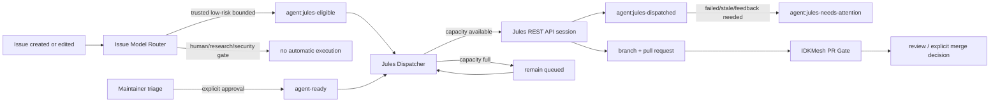

# Jules development automation

IDKMesh uses Google Jules as a **bounded implementation worker**, not as an
integration authority. The automation is designed to keep small coding work
moving quickly while preserving the repository's existing verification and
human-governance boundaries.

## One-sentence operating model

**Single-dispatcher invariant:** the REST-API path described here is the only
project-operated automatic Jules dispatcher. Do not run a second API dispatcher
for the same repository. The legacy native GitHub App `jules` label is retained
only as an explicit manual fallback and is never emitted by the automatic
dispatcher.

There are two trusted ingress paths:

1. **automatic route:** the deterministic Issue Model Router classifies a
   low-risk bounded issue as `agent:jules-eligible`; the dispatcher accepts that
   label only when GitHub reports the issue author association as
   `OWNER`, `MEMBER`, or `COLLABORATOR`;
2. **manual route:** a maintainer/trusted triager adds `agent-ready`, which is
   an explicit human approval and does not depend on the issue author's
   association.

Both paths converge on the same guarded Jules REST API session with
`AUTO_CREATE_PR`, then normal IDKMesh CI/review remains the integration
authority.



The automatic provider path uses the Jules REST API documented at
<https://jules.google/docs/api/reference/>. Sessions are created with
`requirePlanApproval: false` and `automationMode: AUTO_CREATE_PR`. Jules'
documented session states include `QUEUED`, `PLANNING`,
`AWAITING_PLAN_APPROVAL`, `AWAITING_USER_FEEDBACK`, `IN_PROGRESS`,
`PAUSED`, `FAILED`, and `COMPLETED`. The API is currently alpha, so
provider-contract changes remain an external compatibility risk.

## Who does what

| Actor | Responsibility | Must not do |
| --- | --- | --- |
| issue author / contributor | describe a bounded problem and acceptance criteria | self-declare human evidence as satisfied |
| Issue Model Router | classify capability/authority and emit `agent:jules-eligible` only for the configured low-risk lane | grant merge authority or bypass the dispatcher's trusted-author/veto checks |
| maintainer / trusted triager | manually approve a bounded task with `agent-ready`; inspect attention states | add approval to human-only, research-evidence, or security-sensitive work |
| Jules Dispatcher GitHub Action | enforce trust/veto/capacity policy, reconcile provider sessions, create one Jules API session, record repository status | infer safety from arbitrary prose, expose the API key, silently duplicate a session, or merge code |
| Google Jules REST API / worker | execute approved bounded work and create a PR | act as independent verifier or integration authority |
| IDKMesh CI | test the exact PR candidate | decide scientific validity or governance approval |
| maintainer / reviewer | review evidence and decide integration | treat agent output as self-validating |

## One-time owner setup

Automatic dispatch requires two provider-side prerequisites:

1. connect `MSKazemi/idkmesh` to Jules through the Jules web app/GitHub App;
2. create a Jules API key in Jules settings and store it only as the repository
   Actions secret `JULES_API_KEY`.

The dispatcher never prints the key and the key must not be committed, pasted
into issues/PRs, or stored in ordinary repository variables. If the secret is
missing, live dispatch fails closed with an explicit error rather than silently
falling back to the unreliable bot-applied `jules` label path.

The official authentication guide is
<https://jules.google/docs/api/reference/authentication/>.

## Trigger frequency

The system is event-first; schedules are recovery mechanisms.

**Automatic fast path — event driven.** The Issue Model Router runs when an
issue is opened, edited, or reopened. When its deterministic policy emits
`agent:jules-eligible`, the router explicitly invokes
`jules-dispatch.yml` with `workflow_dispatch.issue_number`. This explicit
handoff is important because GitHub normally suppresses recursive workflow
starts caused by mutations made with `GITHUB_TOKEN`.

**Manual fast path — event driven.** Adding `agent-ready` directly triggers
the Jules Dispatcher. The newly approved issue is prioritized and at most one
task is started by that event.

**Capacity-release path — event driven.** Closing an open dispatched issue
immediately invokes reconciliation and fills newly available capacity.

**Recovery/reconciliation path — every 30 minutes.** At minutes 17 and 47 UTC,
the dispatcher checks provider session state, quarantines failed/stale work,
and fills free slots. GitHub scheduled runs are best-effort and may be delayed,
so this is not the primary path.

The Issue Model Router also has a slower backfill schedule for reclassification.
Manual `workflow_dispatch` remains available for operators, including an
optional `issue_number` and an explicit `bootstrap_labels` control.

## Queue and concurrency policy

The machine-readable policy is
[`../../config/jules-dispatch.json`](../../config/jules-dispatch.json).

Current defaults:

- maximum open active Jules issues: **4**;
- maximum new dispatches per recovery sweep: **2**;
- event-driven dispatch starts at most **1** routed/approved issue immediately;
- one GitHub open-issue snapshot is reused for capacity and candidate selection;
- one Jules session-list snapshot is reused for reconciliation and duplicate
  detection within a run;
- legacy/manual open issues carrying `jules` still consume capacity during
  migration so old work is not double-dispatched.

The four-slot limit is repository review/backpressure, not a provider quota.
A `COMPLETED` Jules session continues to consume its issue slot until the
issue closes, so generation cannot run far ahead of PR review. By contrast, a
failed/stalled session is moved to `agent:jules-needs-attention`, its
`agent:jules-dispatched` reservation is removed, and the freed slot may be
used by other safe work.

Provider health thresholds are policy, not hidden constants:

- missing matching API session after **60 minutes** -> attention;
- `QUEUED` without update for **120 minutes** -> attention;
- `PLANNING` without update for **180 minutes** -> attention;
- `IN_PROGRESS` without update for **360 minutes** -> attention;
- `FAILED`, `AWAITING_PLAN_APPROVAL`, `AWAITING_USER_FEEDBACK`,
  `PAUSED`, or `STATE_UNSPECIFIED` -> immediate attention on reconciliation.

Reconciliation never creates a replacement session automatically.

## Label contract

### Queue and execution labels

| Label | Meaning |
| --- | --- |
| `agent:jules-eligible` | deterministic router says this is a low-risk bounded Jules-shaped task; dispatcher still requires a trusted author association |
| `agent-ready` | maintainer/trusted-triager explicit approval for bounded coding-agent execution |
| `agent:jules-dispatched` | active repository reservation/status for an API-backed Jules session |
| `agent:jules-needs-attention` | provider work failed, stalled, paused, needs feedback, or cannot be matched; automatic redispatch is blocked |
| `jules` | legacy/manual native-App trigger; never added by automatic dispatch |

The separation matters: routing metadata is not execution authority, and
execution status is not verification authority.

### Hard veto labels

Any of these prevents automatic dispatch even if a queue label is present:

- `blocked`;
- `do-not-automate`;
- `human-required`;
- `needs-decomposition`;
- `research-evidence`;
- `security-sensitive`;
- `agent:jules-needs-attention`.

The dispatcher fails closed on these labels.

## Scheduling labels

Priority weights:

- `priority:p0` — highest;
- `priority:p1` — high;
- `priority:p2` — normal.

Size weights:

- `size:xs`;
- `size:s`;
- `size:m`.

Within the recovery queue, higher priority wins. For equal priority, smaller
bounded work receives a small preference. `bug`, `good first issue`, and
`documentation` receive small tie-breaking bonuses. The issue that just
received `agent-ready` is attempted first on the event-driven path.

## Eligibility and manual-approval checklist

The automatic router may nominate low-risk work, but the dispatcher still
requires a trusted GitHub author association. For work outside that narrow
automatic lane, use `agent-ready` only when all of these are true:

1. the deliverable is concrete and can fit in one focused PR;
2. acceptance criteria are observable;
3. normal repository tests/CI can verify a meaningful part of the result;
4. the issue does not require a genuine new-human observation;
5. the issue does not require independent research/evidence collection;
6. it is not a security approval, governance decision, secret-management task,
   or broad architecture redesign;
7. the issue body contains no credentials/private data;
8. allowed scope, required tests, and stop conditions are stated.

Good automatic tasks include small bugs, focused tests, deterministic tooling,
narrow documentation/code consistency fixes, and bounded refactors.

Do **not** auto-dispatch external-machine evidence collection, newcomer
observation, independent audits, research conclusions, security approvals, or
large roadmap/architecture work.

## Speed without flooding review

Development speed comes from a continuously replenished queue of small,
verifiable work—not unlimited concurrency.

Recommended operating rhythm:

1. keep several `size:xs` / `size:s` issues fully specified;
2. let the Issue Model Router automatically nominate trusted low-risk tasks;
3. use `agent-ready` for explicit maintainer-approved tasks that are not in
   the automatic lane;
4. let event-driven dispatch fill the four active slots;
5. let the 30-minute reconciliation sweep free slots held by genuinely stalled
   provider sessions;
6. review/merge/close completed PRs promptly so completed work frees capacity;
7. decompose broad work with `needs-decomposition` instead of sending vague
   prompts.

If review latency grows, lower concurrency before creating more generated work.

## What happens after Jules starts

The dispatcher comments on the issue with the returned Jules session URL/name.
Sessions are created with `automationMode: AUTO_CREATE_PR`, so Jules can open a
pull request without the GitHub Actions workflow receiving pull-request write
permission. Jules provider-side repair behavior does not replace IDKMesh's
required checks or reviewer judgment.

The repository PR gate remains authoritative for automated integration checks:

- required Python versions;
- unit/integration behavior;
- deterministic link checks;
- existing schema/workflow invariants.

No Jules task auto-merges `main`.

## Failure and recovery runbook

### `agent:jules-eligible` exists but dispatch never starts

1. inspect the Issue Model Router run and confirm its explicit
   `workflow_dispatch.issue_number` handoff succeeded;
2. verify the issue author association is `OWNER`, `MEMBER`, or
   `COLLABORATOR`;
3. check hard-veto and `agent:jules-needs-attention` labels;
4. check whether four active/legacy Jules issues consume capacity;
5. inspect the Jules Dispatcher run and provider credential/source errors.

### `agent-ready` exists but `agent:jules-dispatched` does not

1. check the Jules Dispatcher Actions run;
2. verify the `JULES_API_KEY` Actions secret exists and is valid;
3. verify Jules Sources lists `MSKazemi/idkmesh`;
4. check active capacity and hard-veto labels;
5. use manual workflow dispatch or wait for the recovery sweep.

### `agent:jules-dispatched` exists but no PR appears

The dispatcher records the Jules session URL in an issue comment. The
30-minute reconciliation cycle compares active reservations with current Jules
session state. Failed, feedback-required, paused, missing-after-grace, and
stale sessions are moved to `agent:jules-needs-attention` and removed from
the active pool.

Do not simply remove `agent:jules-needs-attention`. First inspect the provider
session. For an old queued/active session, resolve or delete that provider work
before allowing a new attempt. Reconciliation intentionally never creates a
replacement session.

A returned 4xx during session creation removes the reservation for a safe
corrected retry. A network error or provider 5xx is ambiguous, so the
reservation is retained until reconciliation/operator inspection prevents a
duplicate POST.

### GitHub API rate limit is exhausted

Routine dispatch uses one issue-list snapshot and label bootstrap is not part of
the hot path. If GitHub still returns a rate-limit response, the dispatcher
fails closed and reports a deferred run; the next recovery sweep retries
without creating provider work.

### Manual fallback with `jules`

Use the legacy `jules` label only as an explicit owner action when the API lane
is deliberately disabled or being repaired. Do not have automation add it: live
repository evidence showed that Jules did not reliably react when
`github-actions[bot]` applied it.

### Jules creates a failing PR

Let normal CI expose the failure. Provider-side CI repair may update the PR.
The exact final head still has to pass repository checks. Never weaken tests
merely to make an agent PR green.

### Too many PRs waiting for review

Lower `max_in_flight` or stop adding manual approvals. Generation speed is not
useful if verification becomes the bottleneck.

## Implementation surfaces

- workflow: [`.github/workflows/jules-dispatch.yml`](../../.github/workflows/jules-dispatch.yml)
- policy: [`config/jules-dispatch.json`](../../config/jules-dispatch.json)
- dispatcher: [`tools/jules_dispatcher.py`](../../tools/jules_dispatcher.py)
- tests: [`tests/test_jules_dispatcher.py`](../../tests/test_jules_dispatcher.py)
- agent instructions: [`AGENTS.md`](../../AGENTS.md)

## Changing the policy

Policy changes go through a normal PR. At minimum:

```bash
python -m pytest -q tests/test_jules_dispatcher.py
python scripts/check_links.py
make gate
```

For changes that alter GitHub permissions, triggers, the Jules API contract, or
the approval boundary, review the security implications explicitly. Keep
`issues: write` scoped to the dispatcher workflow; the workflow checks out the
trusted default branch and sends approved issue text only as API data, never as
shell/code input. Never echo or persist `JULES_API_KEY`.
