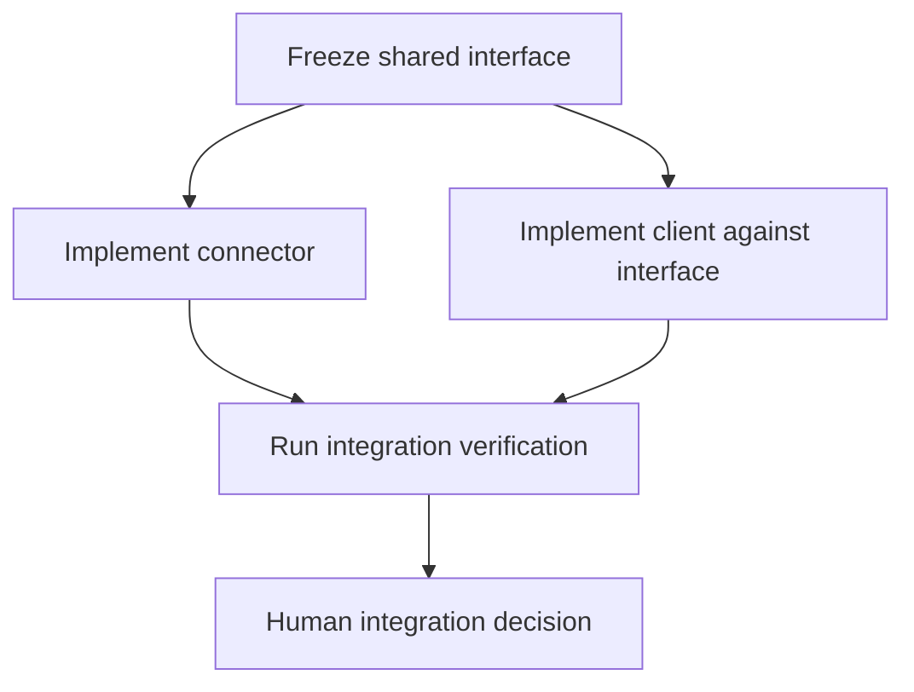

# Human–agent coordination: ownership, recovery, dependencies, and allocation

**Date:** 2026-10-04  
**Status:** proposed implementation and evaluation plan; not an accepted ADR or a new runtime capability  
**Inspected main:** `52cbf2992eca8908d0b9fac9c0d3c5b8ca4ebbe8`  
**Owners:** C9 [issue 597](https://github.com/MSKazemi/idkmesh/issues/597), C10 [issue 598](https://github.com/MSKazemi/idkmesh/issues/598), C5 [issue 578](https://github.com/MSKazemi/idkmesh/issues/578), Product Spine [issue 682](https://github.com/MSKazemi/idkmesh/issues/682).

## 1. Answers and scope

Yes: IDKMesh's intended product is a platform for humans, agents, tools, and compute donors to collaborate on bounded, verifiable work. It currently has executable foundations and some product surfaces, rather than a complete production collaboration platform.

The appropriate design is a composition of small mechanisms. No single biological, mathematical, or economic algorithm solves ownership, dependency correctness, model quality, and social participation together.

| Owner question | Recommended mechanism | Default behavior |
| --- | --- | --- |
| How do we avoid 100 people/agents implementing the same task? | Shared task identity, atomic claims, leased ownership, and admission reservations | One primary implementation slot per logical task |
| When should multiple solutions compete? | Explicit experiment/search budget and marginal expected benefit | Admit a second distinct attempt only for a declared purpose; pilot ceiling of three concurrent implementations |
| What if someone disappears or stalls? | Acknowledgement deadline, liveness lease, progress deadline, cancellation/reconciliation, and fenced reassignment | Preserve progress; revoke stale authority; resolve old execution occupancy before replacing it |
| How do tasks depend on each other? | Versioned prerequisite DAG plus immutable artifact/source bindings | Dispatch only ready tasks; reject cycles and stale inputs |
| Which model or human should receive a task? | Existing capability/authority floors, measured effort and quality estimates, then budget-constrained routing | Deterministic tool first when applicable; otherwise the smallest eligible capable lane |
| How do we control energy and review waste? | Separate resource caps, review backpressure, and marginal allocation | Pause generation when verification or resources are saturated |

The proposed limits and timings below are **pilot policy choices**, not measured optima. An explicit, preregistered research experiment may propose a larger population with separate authorization and budgets. Fifty uncontrolled implementations of one ordinary task are outside the proposed automatic lane.

## 2. What the repository already has

This audit inspected applicable contributor rules, current main, relevant issues, the open PRs, recent merged PRs, and coordination-related branch searches. Documentation PRs open at inspection time (903, 912) do not implement this shared claim protocol. An open umbrella issue does not mean its constituent mechanisms are missing.

| Current artifact | Implemented or retained behavior | Boundary still needing work |
| --- | --- | --- |
| [WorkUnit v0.2](https://github.com/MSKazemi/idkmesh/blob/main/schemas/work-unit-v0.2.schema.json) and [composability profile](../specifications/WORK_UNIT_COMPOSABILITY_V0_2.md) | Explicit task contracts and `requires` projection; benchmark validation rejects dependency cycles | This benchmark is read-only; it is not a live ready-task dispatcher |
| [Issue Model Router](https://github.com/MSKazemi/idkmesh/blob/main/scripts/issue_model_router.py) | Explainable T0–T4 rules, floors, human gates, and override support | Its issue-length/checklist/reference signals are heuristics; its confidence labels are not calibrated success probabilities |
| [Connector router](https://github.com/MSKazemi/idkmesh/blob/main/idkmesh/connector_routing.py) | Provider-neutral eligibility, non-compensating policy gates, transparent lexicographic selection | It does not estimate task completion distributions or implement a learned budgeted scheduler |
| [Local metadata store](https://github.com/MSKazemi/idkmesh/blob/main/idkmesh/connector_store.py) and [Product Spine idempotency adapter](https://github.com/MSKazemi/idkmesh/blob/main/idkmesh/product_spine_idempotency.py) | Restart-safe local request reservation/replay and conflict detection | Local reference idempotency is not a multi-provider, multi-human task lease or a distributed ledger |
| [Jules dispatcher](https://github.com/MSKazemi/idkmesh/blob/main/tools/jules_dispatcher.py) and [operations contract](../operations/JULES_AUTOMATION.md) | Provider/repository capacity, duplicate checks, provider-session reconciliation, stalled-work attention, and CI backpressure | Jules-specific state is not global ownership shared by all humans and connectors |
| [Two-attempt orchestrator](https://github.com/MSKazemi/idkmesh/blob/main/experiments/two_attempt_orchestrator.py) | Bounded attempt evidence, separate verification, and non-selecting reports | This does not authorize automatic best-candidate selection or protected integration |
| [R2](../research/R2_SCHEDULING_CHURN_EXPERIMENT.md), [R3](../research/R3_EVOLUTIONARY_ORCHESTRATION.md), [R4](../research/R4_STIGMERGIC_ROUTING.md), and [AVE](../algorithms/ADAPTIVE_VERIFICATION_ECOLOGY.md) | Scheduling, evolutionary, stigmergic, and verifier-allocation research machinery | Synthetic mechanism results do not prove live human–agent performance |
| [Existing GitHub-first multi-user plan](../architecture/GITHUB_FIRST_DEPLOYMENT_AND_MULTIUSER.md) | Already identifies durable idempotency, claims, expiry, and actor roles | C9/C10 still own the common live protocol and recovery proof |

This proposal extends those owners. It creates no parallel WorkUnit, evidence contract, router, authority service, or provider dispatch loop. It does not change the protected Jules workflow handoff, automatic-lane trust rules, or zero-project-spend policy.

## 3. One task identity and atomic ownership

### 3.1 Separate intent, execution, and message identity

Use three different identities:

1. **Logical task identity:** tenant/project plus a stable canonical task ID and approved outcome scope. This is the ownership boundary shared by humans and every connector. It persists across a rebase or retry. Known duplicate issues resolve through an explicit alias to this identity.
2. **Execution binding:** logical task plus WorkUnit version/digest, exact source revision, dependency artifact digests, policy revision, and admitted slot. This says precisely what an attempt may work on.
3. **Dispatch operation identity:** execution binding plus a coordinator-allocated attempt number. A retry of the same provider-create operation reuses it. A deliberate new attempt requires a fresh admitted identity.

GitHub delivery IDs and caller request IDs belong to the transport deduplication layer. They must not create fresh task slots. Different actors, event deliveries, or providers can request the same logical task. Adding their identities to the ownership key would let each bypass the duplicate limit.

A changed source revision invalidates the old execution binding; it does not silently free the logical task for an unrelated duplicate owner. A truly different deliverable receives its own approved logical task identity.

Exact identifiers catch exact duplicates. Different prose describing equivalent work requires semantic triage: compare outcome, affected contracts/paths, acceptance criteria, and issue references. Embeddings or fingerprints may suggest duplicates; they cannot merge tasks or revoke a human's claim without the canonical policy decision. No hash can solve semantic equivalence by itself.

### 3.2 Claim before dispatch

The future common admission transaction should:

1. resolve aliases and the canonical task revision;
2. check actor authority, task readiness, input freshness, and connector eligibility;
3. check task, actor, project, provider, compute, quota, and review reservations;
4. atomically compare the current ledger revision and reserve an available task slot;
5. assign attempt identity, owner, fencing epoch, acknowledgement deadline, lease expiry, and hard budget;
6. retain the dispatch intent before any provider call;
7. dispatch only from that retained intent; attach the observed provider-session identity afterward.

The decisive invariant is:

```text
admitted active + unresolved execution reservations for task w <= K_w
```

Use a uniqueness constraint or compare-and-swap on the task/slot record, not a read of labels followed by an unconditional write. A hundred simultaneous callers under `K_w = 1` should produce one reservation; the others receive the existing status or a claim conflict. Human and agent requests compete in the same transaction.

Labels, issue assignees, dashboards, and notifications are projections of this record. They cannot be the sole lock. Two identical-looking labels do not prove exclusive admission.

### 3.3 Fencing and late results

Each ownership grant gets a monotonically increasing epoch **per task slot**. Renewal, result submission, and privileged downstream writes must check the current owner, slot, epoch, binding, and authority. In a competition, each admitted slot has its own valid epoch; adding a second slot must not invalidate the first.

If slot 1 expires at epoch 7 and is later granted at epoch 8, the old epoch-7 worker cannot submit into the current slot. Its artifacts may be retained as late evidence and deliberately salvaged through a new verified admission; they cannot silently replace current evidence.

A fencing token works only at boundaries that enforce it. It cannot stop an uncooperative external worker consuming electricity or writing outside the authorized system. Native human/GitHub permissions remain external authority. The defensible guarantee is exclusive **registered admission and canonical effects**, with bounded recorded overlap; it is not physically preventing every outsider from doing similar work.

Expiry is assessed by the authoritative coordinator/store, never by an untrusted worker's timestamp. Use monotonic elapsed time for local running deadlines and persisted authoritative expiry/epoch records for restart recovery. After restart or uncertain clock movement, reconcile and fail closed on ambiguous ownership; a new process's monotonic clock cannot reconstruct the old process's lease by itself. Every renewal compares the current grant and must not revive an already expired epoch.

### 3.4 Storage and delivery profiles

| Profile | Appropriate implementation direction | Required caution |
| --- | --- | --- |
| Local reference | Extend the existing SQLite transaction/uniqueness owner | Separate local processes on one authoritative database; do not copy the database into competing authoritative instances |
| GitHub-first | C9 durable ledger; trusted reconciliation and optimistic, append-only ledger updates | GitHub Actions concurrency is only a scheduling aid. Ref-update races must reject/replan; labels/comments are not atomic locks. Pending events require later reconciliation rather than an assumed FIFO |
| Network/multi-user | One authoritative transactional store/service, with tenant-scoped claims and budget reservations | A distributed store such as etcd is an option when justified, not a bootstrap dependency |

For a Git-backed ledger, build a successor from the exact expected ledger head and publish it with a non-force ref update. If another successor wins, the competing branch is not a fast-forward; discard/replan the state mutation. Protect the ledger from rewinds and bypass writers. This is a proposed C9 design, not a guarantee already established by GitHub labels.

Provider dispatch is a separate external effect. Use a retained outbox/dispatch intent and provider idempotency support where available. If a create call times out after possibly succeeding, enter `dispatch_unknown`, keep its reservation, and reconcile the provider session before creating another. Without provider idempotency or conclusive reconciliation, abstain for operator attention. A transaction around our ledger cannot manufacture exactly-once behavior in an external API. [S1–S3]

## 4. Allow useful competition, cap repetition

### 4.1 Different purposes need different roles

| Purpose | Allocation |
| --- | --- |
| Routine implementation | One primary worker; independent verification follows |
| Decomposable feature | Several workers on distinct bounded tasks with explicit dependencies |
| Ambiguous design or search | Two distinct proposals/implementations; a third only within an approved budget and comparison plan |
| Slow attempt with deadline pressure | One delayed hedge only if the task is safe to duplicate and capacity/occupancy remains admitted |
| Independent review | Verifier-owned work and budget; it is not an extra implementation slot |

Prefer role diversity and task decomposition before cloning the same implementation job. A human designing a contract, an agent implementing it, and a verifier testing it are complementary participants.

Each task needs separate limits for concurrent implementations, lifetime attempts, generation resources, verifier resources, and human attention. For an initial low-risk pilot, `K_concurrent = 1` and a lifetime ceiling of three total implementation attempts are reasonable starting choices. Competition can raise concurrency to two, exceptionally three, while keeping the lifetime budget explicit. A retry consumes the lifetime budget even when its predecessor has stopped.

### 4.2 Marginal allocation rule

Let `S` be admitted candidates, `V_w` the value of an acceptable outcome, and `P_success(S)` the probability that a correct candidate becomes available under the declared search/evaluation procedure. For an additional worker `j`, an economic recommendation is:

```text
Delta U(j | S) = V_w * [P_success(S union {j}) - P_success(S)]
                - additional generation cost
                - additional verification/selection cost
                - opportunity cost of delaying other work
```

Admit it only within every hard constraint and when a conservative estimate of the marginal benefit justifies the resource cost. Unknown marginal benefit is an explicit uncertainty, not permission for unlimited replication. A bounded exploration experiment may spend a declared budget to learn it.

The costs may be measured in time, quota units, joules, and attention; a common utility scale is an explicit policy conversion, not money IDKMesh is authorized to spend.

For an **illustrative independent-success model** with identical success probability `p` and perfect selection:

```text
P_success(k) = 1 - (1-p)^k
gain from candidate k+1 = p * (1-p)^k
```

At `p = 0.6`, `V = 100` utility units, and total incremental cost `c = 8` units per candidate:

| Candidates | At least one correct candidate | Net utility `100*P - 8*k` |
| --- | ---: | ---: |
| 1 | 60% | 52.00 |
| 2 | 84% | 68.00 |
| 3 | 93.6% | 69.60 |
| 4 | 97.44% | 65.44 |
| 50 | Approximately 100% | Approximately -300.00 |

The toy optimum is three. It is **not** an IDKMesh production claim. A different success rate, resource price, risk, or evaluator changes it.

Now assume a shared failure occurs with probability `q = 0.25`, and workers succeed independently with probability `a = 0.8` only when that shock is absent:

```text
P_success(k) = (1-q) * [1-(1-a)^k]
```

One worker still succeeds with probability 60%, but two reach 72%, three reach 74.4%, and even fifty approach only 75%. With the same costs, the toy optimum is two. More agents cannot remove a shared bad requirement, missing dependency, or evaluator blind spot.

Do not estimate this from provider names alone, or size a verifier panel with `N/(1+(N-1)*rho)` as if it guarantees correct aggregation. The repository's [marginal-verifier owner](https://github.com/MSKazemi/idkmesh/issues/693) and [worker-dependence experiment](../../experiments/E042-worker-dependence-shape.md) already address related distinctions.

### 4.3 Evaluation and stop rules

Freeze acceptance criteria, source inputs, hidden/held-out evaluation where appropriate, candidate limits, and stopping rules before results arrive. Evaluate the same functional and provenance requirements for every candidate. Required failures cannot be compensated by readability, speed, votes, or a model's confidence.

For candidates that satisfy those requirements, compare correctness evidence, maintainability, regressions, integration conflicts, resource use, and reviewer effort. Report ties/uncertainty and Pareto trade-offs. The current non-selecting report and explicit human decision remain authoritative; an allocation score does not choose a winner or merge it.

Stop creating attempts when the search budget is exhausted, a sufficient candidate is verified and the search policy permits stopping, expected marginal value is too small, or verification is saturated. Stop/cancel unused sessions and record what could not actually be cancelled. Preserve failures so the next worker does not repeat them.

More candidates also increase evaluator exposure: with independent per-candidate false acceptance probability 2%, the probability of at least one false acceptance among 50 is `1 - 0.98^50 = 63.58%`. This is a toy warning, not a measured validator rate. Statistical evaluators need a declared familywise/sequential error budget across attempts; deterministic tests still need held-out/adversarial cases and explicit limitations. Selecting the first passing candidate is not proof of correctness. [S4]

## 5. Recovery when a worker disappears, stalls, or fails

### 5.1 Four clocks

Keep these clocks separate:

| Clock | What it establishes | Action on expiry |
| --- | --- | --- |
| Acknowledgement deadline | The assignee accepted the task | Reconcile dispatch/claim state; withdraw unacknowledged authority |
| Liveness lease | The worker/session is still reachable | Mark suspect; stop renewing; fence the expired grant |
| Progress deadline | Useful progress or a blocker was reported | Request a checkpoint/extension or classify the stall |
| Hard execution deadline | Authorized runtime/resource budget remains | Request termination; preserve evidence; reconcile remaining occupancy |

A heartbeat proves liveness, not progress, correctness, or permission to run forever. A progress update cannot bypass a hard runtime, token, energy, or donor limit.

For a controlled local-agent pilot, an example is a 60-second heartbeat, a five-minute liveness lease, and a task-specific hard runtime budget. Hosted polling must use a longer lease consistent with its supported polling/rate limits. A GitHub-only periodic reconciler cannot promise sub-minute recovery; detection delay includes the reconciler cadence and platform queueing.

Humans use agreed check-in and expected completion windows, availability/timezone information they choose to share, and a grace period. For example, a short task could use a 48-hour check-in window by agreement. Do not apply agent heartbeat intervals to volunteers or treat missed check-ins as evidence of poor technical quality.

With sufficient comparable observations, runtime budgets may use a task-class/capability-specific duration quantile plus margin. Include cancelled/time-limited attempts as censored observations; completed-only averages underestimate slow work. Until that evidence exists, use transparent bounded defaults and human estimates. Expiry is a failure suspicion, not proof that a worker crashed.

### 5.2 Recovery procedure

1. Atomically record the suspect/expired grant and revoke its canonical submission authority.
2. Inspect existing provider status, candidate artifacts, and checkpoints. Distinguish worker loss from coordinator/polling/API failure.
3. Request cancellation where supported. A cancellation request is not confirmation of termination.
4. Keep unknown or still-running execution charged to resource reservations. If replacement would violate `K_w` or provider/donor limits, queue it. Controlled overlap requires an explicitly admitted extra slot and budget.
5. Once replacement is permitted, grant a new attempt identity and a higher slot epoch. Reuse only independently checked checkpoints with matching source and task bindings.
6. Classify the failure before choosing retry, escalation, decomposition, clarification, or operator attention.
7. Preserve late outputs as stale evidence, and release capacity only after terminal state or a justified reconciliation policy.

The ownership lease and execution reservation are different records: revoking permission does not make a remote process vanish. An expired slot can have no valid writer while its old execution still consumes the task's occupancy budget.

| Failure class | Appropriate next action |
| --- | --- |
| Explicit quota/rate rejection before creation | Queue; obey retry guidance and quota reset; no paid fallback |
| Transient transport failure on a proven idempotent operation | Bounded retry with backoff and jitter |
| Unknown provider-create outcome | Reconcile; keep reservation; no blind second creation |
| Unclear requirements or unsatisfied dependency | Clarify or replan the WorkUnit; bigger models cannot repair missing authority/input |
| Repeated semantic/test failure | Use retained evidence to escalate capability or split the task within lifetime limits |
| Missing tool, sandbox, secret permission, or supported runtime | Repair/choose an eligible environment; do not merely increase model size |
| Human unavailable | Apply the agreed release/grace policy, preserve attribution, and offer a new owner |
| Terminal security/provenance breach | Block and route to the authorized owner; ordinary retry is inappropriate |

For transient eligible retries, use full-jitter bounded exponential backoff, for example `delay ~ Uniform(0, min(cap, base*2^n))`, subject to provider retry guidance and the remaining deadline. Keep one retry owner in the control plane rather than multiplying retries across every layer. A delayed hedge is a separate admitted attempt, not a retry loophole. [S3–S4]

## 6. Dependency correctness and scheduling

### 6.1 Prerequisites are a DAG

Reuse WorkUnit v0.2 `requires` semantics. The current composability projection represents a WorkUnit pointing to its prerequisite. Scheduling can index the reverse adjacency from prerequisite to dependents without redefining that relation.

Do not interpret every issue reference, `informs`, `derived_from`, `validates`, or `blocks` relation as an executable prerequisite. If another relation gains scheduling semantics, it needs a reviewed versioned contract.

For task `w`:

```text
Ready(w) = every required prerequisite has its declared satisfied state
           AND every required artifact/source binding is current
Dispatchable(w) = Ready(w) AND authority permits dispatch
                  AND resource reservations can be admitted
```

For ordinary Git code dependencies, default to **integrated prerequisite revision plus exact artifacts/evidence**. An issue being closed, a worker saying done, or CI passing is insufficient by itself. If a pipeline deliberately permits working on verified but unintegrated candidates, make that a separate explicit policy and bind the complete candidate stack. It must not imply permission to merge.

Use cycle detection/topological sorting in `O(V+E)` and a ready queue with prerequisite counters. Apply each satisfaction event idempotently; a repeated event must not decrement the counter twice. Check missing targets, rejected prerequisites, incompatible versions, and partial ledger recovery.



Version the graph and bind each attempt to the graph/input snapshot. When an upstream output changes, invalidate or revalidate the affected descendants; leave unrelated branches alone. A late upstream failure blocks dependent dispatch and requires a new downstream binding, not rewriting old evidence.

Dependency correctness and write conflicts are separate. Track overlapping APIs, migration names, paths, and other exclusive resources in a conflict index. Path overlap is a useful warning, not proof of conflict. Workers use isolated candidate workspaces; protected integration serializes canonical effects. Do not lock the whole repository because two tasks touch the same documentation file.

### 6.2 Prioritize the critical path, then match eligible capacity

A HEFT-inspired baseline uses estimated execution time and input/verification delays to prioritize tasks that unlock the longest remaining chain:

```text
rank_u(w) = mean_estimated_time(w)
            + max over dependents v [dependency_delay(w,v) + rank_u(v)]
```

For terminal nodes the maximum term is zero. The human/verification/integration stages consume time too; omitting them can rank the wrong critical path.

Among already eligible worker/model lanes, use predicted finish time rather than raw job count: a worker with one hour-long job is busier than one with two one-minute jobs. Use uncertainty-aware time estimates and declared availability; deadline priority never removes authority, sandbox, or spend gates. This is a heuristic, not a globally optimal heterogeneous schedule. [S5]

For a large eligible population, compare `capability-power-two`: sample two eligible lanes and choose the lower estimated queued work. This reduces information probes relative to scanning every worker. R2 already tests that family and capability-rarity failures. It is a placement heuristic; it does not provide exclusive claims or dependency correctness. Human willingness and chosen availability remain eligibility inputs. [S6]

Use aging/weighted fair queues within policy lanes so an endless critical stream does not starve ordinary contributions. Work stealing may transfer only unclaimed ready tasks or a formally released/expired claim; it cannot seize a live owner's task.

## 7. Effort, risk, and model/human selection

### 7.1 Estimate a vector, not a magical difficulty number

Record separately:

- implementation scope and expected work;
- ambiguity and missing context;
- dependency/interface coupling;
- required tools, languages, context size, and execution environment;
- failure impact, reversibility, and authority requirements;
- verification difficulty and expected human review minutes;
- predicted runtime, quota/tokens, donor resources, and uncertainty.

A two-line permission change may be small in effort but high in risk. A long mechanical migration may require little reasoning but substantial execution/verification. Issue length, labels, and model self-confidence cannot establish these dimensions reliably.

Reuse the existing tiers:

| Tier | Suitable task shape | Required care |
| --- | --- | --- |
| T0 deterministic | Formatting, schema checks, reproducible generation, known mechanical operations | Use the maintained tool when it can satisfy the task |
| T1 small | Bounded low-risk change with a clear local acceptance test | Verify the candidate; a cheap model still has no acceptance authority |
| T2 standard | Moderate multi-file work with explicit interfaces | Supply enough context and cross-file tests |
| T3 strong | Cross-component implementation and substantial reasoning | Include integration/risk review appropriate to the task |
| T4 peak | Ambiguous or high-impact architecture, research, control-plane work | Capability remains separate from required human/governance/security gates |
| Human-required authority | Genuine human observation, independent human review, stakeholder/governance judgment | No model tier can satisfy the identity/authority requirement |

Tier selection is a capability requirement; it is not a fixed provider brand or number of model parameters. Freeze and benchmark the actual model version, agent harness, tools, context, and execution profile. A small specialized model may outperform a larger general model in one domain.

### 7.2 Route only after hard eligibility

Keep `resolve_routes()` as the product admission owner. Its current transparent lexicographic selection remains the baseline. Any richer allocation policy starts as a **shadow recommendation**; this document does not alter that function.

With enough frozen same-domain observed outcomes, compare eligible routes using expected total loss:

```text
J(route | task) = time_price * expected_end_to_end_seconds
               + quota_price * expected_quota_use
               + energy_price * expected_joules
               + attention_price * expected_review_minutes
               + rework_probability * rework_loss
               + escaped_defect_probability * escaped_defect_loss
```

Weights explicitly convert unlike units into a policy-defined loss scale. Hard constraints remain outside this sum. A low loss estimate cannot compensate for forbidden spend, external processing, tenant access, insufficient capability, a missing human gate, or an unsatisfied required check.

Prefer Pareto/lexicographic comparisons until those conversions are defensible. If a minimum success target is introduced, define the outcome and calibration dataset and check a conservative uncertainty bound. Unknown model capability is not a passing estimate. Sparse evidence should produce a transparent conservative route or queue/clarification, rather than invented precision.

A small-first cascade is useful only when the initial cheap attempt is plausibly capable and safe. Stop after its candidate satisfies the required evaluation; escalate on categorized failure or unresolved evidence. For an obvious high-impact T4 task, skip cheap attempts that cannot meet the floor. Include failed cheap attempts and reviewer costs when comparing cascades with direct strong-model execution. RouteLLM and FrugalGPT motivate routing/cascades, but their reported benchmarks do not establish IDKMesh coding-task success rates. [S7–S8]

### 7.3 Learning without runaway experimentation

Use task-class-specific observations of verified outcomes, completion time, review effort, and resource consumption. Keep coordinator outages, human unavailability, semantic failure, and policy rejection separate. Do not convert every failure into a model-quality penalty.

A useful research baseline is per-class Thompson sampling with Beta success/failure posteriors, compared against the static router and greedy measured quality. Full feature-dependent allocation can later compare a contextual bandit with resource budgets. Hard policy filters and reservations still run first; budgeted-bandit regret results rely on assumptions that are not automatically true for changing model APIs and volunteers. [S9]

Start with a small declared exploration budget on eligible, low-risk work; a 5% allocation is a pilot choice, not a proven optimum. Log the recommendation and propensity before the outcome, freeze thresholds on training tasks, evaluate held-out tasks, and reset/discount evidence when model, harness, task domain, or resource conditions change. Timeouts remain censored duration evidence; selective dispatch means outcomes are not an unbiased sample of all tasks.

No durable global human/model reputation score is needed. Passing a synthetic probe is not positive live reliability, and an agent cannot create independent review authority by generating another identity.

## 8. Economics, physics, biology, and social design

### 8.1 Resource economics and queue stability

Project-funded compute remains exactly `$0` under [PROJECT_RULES](../../PROJECT_RULES.md) and [compute policy](https://github.com/MSKazemi/idkmesh/blob/main/config/compute-policy.json). The scheduler cannot price scarcity and then buy capacity. With no eligible zero-project-cost lane, queue, reduce scope, seek opt-in capacity, or abstain.

Track provider quotas, CI minutes, CPU/GPU time, memory, disk, bandwidth, energy, and human attention separately. Reserve against upper task budgets before dispatch, refund measured unused resources where justified, and never erase unresolved execution occupancy. Per-project/actor limits stop one noisy participant consuming every slot; donor thermal/battery/network limits are enforceable caps where the backend supports them.

For verification arrivals `lambda_v` and sustainable verification capacity `mu_v`, target a margin below saturation. If generation creates 12 reviewable candidates per day and reviewers finish four, the backlog grows by eight per day. More workers accelerate that debt. Little's relation `L = lambda * W` connects finite steady-state queue size, throughput, and wait; it does not make an overloaded queue stable. [S10]

Keep current hard Jules/CI admission ceilings. An optional future controller may cautiously increase admitted concurrency when queues stay below a low watermark and reduce it when they exceed a high watermark, with hysteresis and a minimum dwell time. AIMD is a conventional comparison baseline; feedback delay, service heterogeneity, and discrete jobs require separate stability experiments. A missing pressure signal fails closed. [S11]

### 8.2 Physical resource limits

Measure energy as `E = integral P(t) dt`, with a declared meter boundary and uncertainty. Distinguish whole-device power from incremental workload power. When hosted energy is unknown, record unknown or an explicitly bounded estimate; tokens are not automatically joules, and a free API is not proof of zero energy.

For fixed parallelizable work with serial fraction `s`, Amdahl's ideal bound is `S(N) = 1 / [s + (1-s)/N]`. At `s = 0.2`, fifty workers yield at most about 4.63x under that ideal model, before coordination overhead. This is an illustration for decomposed work, not a law for independent solution search. Pairwise communication can have `N*(N-1)/2` possible links; fifty participants mean 1,225 links. A shared task ledger and bounded DAG reduce the need for all-to-all negotiation. [S12]

Energy efficiency, quota efficiency, and review efficiency should be reported separately per verified/integrated useful outcome. Avoid a single opaque score that rewards more commits or silently trades away correctness.

### 8.3 Which cross-disciplinary mechanisms belong where?

| Field/mechanism | Useful contribution | Recommendation and limit |
| --- | --- | --- |
| Distributed systems: leases, fencing, idempotency | Exclusive registered ownership and recovery | Implement first; biological routing cannot replace these correctness boundaries |
| Mathematics/operations research: DAG, critical path, HEFT, matching | Readiness and heterogeneous placement | Start with simple deterministic heuristics and compare measured finish times |
| Economics: Contract Net, opportunity cost, constrained allocation | Announce bounded work; eligible actors offer capability/availability; reserve scarce resources | Bids are proposals, not evidence or permission. Shortlist candidates instead of soliciting expensive full solutions from everyone [S13] |
| Physics/control: resource accounting, congestion/backpressure | Prevent generation exceeding verification/donor capacity | Measure actual resources and test delayed feedback; avoid thermodynamic metaphors as guarantees |
| Biology: ant-colony stigmergy with evaporation | Task-class affinity that can forget stale successes | Compare only as experimental placement memory. R4's retained synthetic report already finds Thompson sampling competitive/better in tested regimes [S14] |
| Biology: adaptive immunity/diverse detectors | Verifier memory, known-bad probes, complementary defect detection | Extend AVE and marginal-evidence diagnostics; detector count/family name is not proven independence |
| Biology: Physarum adaptive networks | Possible routing across measured resource/network topology | Keep in the existing [Physarum research gate](../research/PHYSARUM_N3_READINESS.md); it does not solve task ownership or semantic dependencies [S15] |
| Evolutionary algorithms | Search across orchestration configurations | R3 research lane only; freeze training/held-out comparisons and complexity budget |
| Society: explicit roles, consent, transparent rules, conflict resolution | Sustainable human participation and legitimate authority | Keep local ownership with project-wide resource/authority rules; preserve newcomer access and voluntary availability. Ostrom supplies design inspiration, not proof of an agent scheduler [S16] |

The proposed near-term stack is therefore **atomic claims + durable reconciliation + prerequisite DAG + existing capability router + bounded search + independent verification + human integration + backpressure**. Learned/bio-inspired placement competes with simpler baselines after those boundaries work.

## 9. Implementation sequence without duplicate issue ownership

This is a slice catalog attached to existing owners, not a new swarm of umbrella issues. Promote one implementation-ready slice at a time after checking current main and PRs.

| Order | Existing owner | Bounded slice and acceptance evidence |
| --- | --- | --- |
| 1 | C10-D under issue 598; C9 contract under issue 597 | Shared logical-task/alias, slot, owner, epoch, and request-binding vocabulary. One hundred concurrent requests, including human and agent identities, yield one grant under cap one; rejected requests have inspectable reasons |
| 2 | C9 issue 597 + C5 issue 578 | Durable claim/admission + dispatch intent + provider-session reconciliation. Restart before/after provider creation cannot silently create another session; unknown create outcomes stay reserved |
| 3 | C10-E under issue 598 | Expiry, progress/hard deadlines, fenced replacement, cancellation and late-result rules. Old epoch rejected; unknown remote occupancy blocks a cap-violating replacement; validated checkpoint handoff retains attribution |
| 4 | WorkUnit/DAG owners issues 4 and 682 (issue 15, now closed, is the source of the WorkUnit contract) | Ready-task projection using only reviewed prerequisite semantics. Cycle/missing-target rejection, duplicate-event replay, revision invalidation, failed-parent blocking, and independent-branch continuation |
| 5 | Existing connector router + C5/C6 + issue 682 | Explicit competition/lifetime/resource budgets and comparable evidence reports. Cap two admits two across all connectors; third rejected; total attempts bounded; no automatic selection/merge |
| 6 | R2/R3/R4, issues 636 and 644, marginal-evidence owner issue 693 | Pre-outcome shadow effort/routing/allocation recommendations. Compare static floors, cheap-first, direct strong, greedy measured quality, Thompson/contextual budgeted policies, and stigmergy with held-out outcomes |
| 7 | Second-project pilot issue 599 | Two real human actors, heterogeneous worker paths, forced restart/stall, dependency chain and cancellation/reconciliation evidence; normal protected integration |

Authentication/authorization must use the existing actor/tenant owners. This document does not turn synthetic identities into the two-real-user acceptance required by C10, nor bypass the independent research/observation gates. Claims and routing must be integrated before the product promises safe unattended multi-user operation.

### 9.1 One coordinator transition, sketched

The following is pseudocode for future composition, not a new executable API:

```text
admit(request):
    resolve canonical task and immutable input binding
    transaction:
        check expected ledger revision and actor authority
        replay equivalent existing operation, or reject conflicting request
        check prerequisites, route eligibility, and all resource budgets
        check task slot and lifetime attempt limits
        reserve slot, budgets, owner epoch, and dispatch intent together
    create/resume provider operation using retained identity
    retain provider reference, or dispatch_unknown on ambiguous outcome

reconcile(attempt):
    read provider state without creating a new operation
    expire/revoke stale grant with expected owner/epoch check
    request termination when required
    keep unresolved execution charged to reservations
    permit replacement only after occupancy/budget admission

submit(candidate):
    check current owner, slot epoch, exact inputs, and task state
    capture immutable candidate/manifest; never accept worker claims as truth
    execute verifier-owned evaluation and retain evidence
    expose comparison to the authorized human integration boundary
```

Task-lifecycle, attempt-lifecycle, ownership-lifecycle, and provider occupancy must remain separate projections of durable records. Do not retrofit proposed state names into frozen existing run schemas without the owning versioned compatibility change.

## 10. Evaluation, stopping, and numerical reproducibility

### 10.1 Fault and workload matrix

Before scaling, test simultaneous claims, duplicate/out-of-order messages, crash after reservation, crash after successful remote creation, ambiguous API timeout, expired owner returning, cancellation without termination, clock skew/restart, exhausted quota, blocked verification, stale upstream artifact, dependency cycle, permission changes, duplicate semantic issues, and competing candidates sharing blind spots.

Compare under matched budgets on frozen tasks, including failures:

- static existing routing with one worker;
- one stronger eligible worker;
- cheap-first escalation;
- two or three competing candidates;
- decomposed task DAG with specialized roles;
- optional learned/stigmergic placement behind the same admission protocol.

Separate mechanistic invariants from performance claims. Zero stale canonical writes and zero over-cap admissions in controlled fault tests are necessary. Synthetic tests cannot prove all external providers terminate or that a real collaboration policy improves productivity.

Preregister primary outcomes, workload, allocation randomization/counterbalancing, resource budgets, stopping rule, model/harness versions, and training/held-out split. Capture recommendations before outcomes; do not backfill shadow plans from completed tasks. A first small 20–30-task cohort is descriptive operational evidence, not a powered claim that one algorithm is best.

Report:

- accidental duplicate admission and intentional replication separately;
- stale-writer rejection and unresolved execution occupancy;
- mean/p95 acknowledgement, stall detection, and recovery delay;
- dependency violations, stale-input attempts, and integration conflicts;
- verified/integrated useful outcomes, escaped defects, and rework;
- total attempt count, quota, resource time, energy/uncertainty, and review minutes;
- queue growth and blocked-admission reasons;
- complementarity of candidate/verifier errors on common held-out tasks;
- human claim release, newcomer opportunity, opt-out, and contributor experience.

If a richer method does not improve the preregistered trade-off over the simpler router within uncertainty, keep the simpler router. If hard invariants fail, stop the pilot regardless of throughput.

### 10.2 Numerical check run in this session

The illustrative arithmetic in sections 4 and 8 was checked with Python `decimal` at 60-digit precision, including exhaustive candidate counts 1–50. This is a calculation, not an execution of agents, a synthetic coordination simulation, or observed productivity evidence.

```python
from decimal import Decimal, getcontext

getcontext().prec = 60
p, q, a = Decimal("0.6"), Decimal("0.25"), Decimal("0.8")
value, cost = Decimal(100), Decimal(8)
independent = lambda k: 1 - (1-p)**k
shared_shock = lambda k: (1-q) * (1-(1-a)**k)
utility = lambda probability, k: value * probability(k) - cost*k

assert max(range(1, 51), key=lambda k: utility(independent, k)) == 3
assert max(range(1, 51), key=lambda k: utility(shared_shock, k)) == 2
for k in (1, 2, 3, 4, 50):
    print(k, independent(k), utility(independent, k), shared_shock(k))
print("50th marginal gain:", p * (1-p)**49)
print("any false acceptance:", 1 - Decimal("0.98")**50)
print("ideal decomposed speedup:", 1/(Decimal("0.2")+Decimal("0.8")/50))
```

Computed: fiftieth marginal independent-success gain about `1.9015e-20`; any false acceptance `0.6358303199`; ideal decomposed speedup `4.6296296296`. These depend on the explicit toy assumptions and must not be used as estimated IDKMesh rates.

## 11. Primary research and documentation consulted

External results support the individual mechanisms. Applying them to this platform is an engineering proposal requiring IDKMesh-specific evidence. No claim of universal optimality or a completed systematic literature review is made.

| ID | Primary source | Use and transfer boundary |
| --- | --- | --- |
| S1 | Gray and Cheriton, [Leases](https://web.stanford.edu/class/cs240/readings/leases.pdf), 1989 | Limited-duration rights under failure; original setting is cache consistency |
| S2 | etcd, [API guarantees](https://etcd.io/docs/v3.6/learning/api_guarantees/) | Atomic ordered operations/revisions, lease behavior, and ambiguous client outcomes; optional service reference |
| S3 | Featonby/AWS, [Making retries safe with idempotent APIs](https://aws.amazon.com/builders-library/making-retries-safe-with-idempotent-APIs/) | Repeated requests and external-side-effect identity; our ledger alone cannot deduplicate a provider |
| S4 | Dean and Barroso, [The Tail at Scale](https://www.barroso.org/publications/TheTailAtScale.pdf), 2013; AWS, [Limit retries](https://docs.aws.amazon.com/wellarchitected/latest/reliability-pillar/rel_mitigate_interaction_failure_limit_retries.md) | Delayed replication and bounded retries; RPC latency results do not establish coding-task quality gains |
| S5 | Topcuoglu, Hariri, and Wu, [HEFT/CPOP](https://ieeexplore.ieee.org/document/993206), 2002 | Heterogeneous prerequisite scheduling; application to human/review stages is an adaptation |
| S6 | Mitzenmacher, [The Power of Two Choices in Randomized Load Balancing](https://www.eecs.harvard.edu/~michaelm/postscripts/tpds2001.pdf), 2001 | Low-information placement; original queue assumptions do not automatically fit heterogeneous volunteers |
| S7 | Ong et al., [RouteLLM](https://arxiv.org/abs/2406.18665), 2024 | Learning quality/cost routing; preference benchmarks are not repository acceptance evidence |
| S8 | Chen, Zaharia, and Zou, [FrugalGPT](https://arxiv.org/abs/2305.05176), 2023 | Model cascades; reported savings are not promised here |
| S9 | Badanidiyuru, Kleinberg, and Slivkins, [Bandits with Knapsacks](https://arxiv.org/abs/1305.2545), 2013; Badanidiyuru, Langford, and Slivkins, [Resourceful Contextual Bandits](https://arxiv.org/abs/1402.6779), 2014 | Learning under scarce resources; changing tasks/models require separate validation |
| S10 | Little, [A Proof for the Queuing Formula](https://www.jstor.org/stable/167570), 1961 | Finite steady-state relationship of backlog, throughput, and waiting time |
| S11 | Chiu and Jain, [Increase/Decrease Algorithms for Congestion Avoidance](https://classes.engineering.wustl.edu/~jain/papers/cong_av.htm), 1989 | Feedback/admission-control baseline; no transferred stability guarantee for agent jobs |
| S12 | Amdahl, [Validity of the Single Processor Approach](https://www3.cs.stonybrook.edu/~rezaul/Spring-2012/CSE613/reading/Amdahl-1967.pdf), 1967 | Serial bottleneck illustration for decomposed fixed work |
| S13 | Smith, [The Contract Net Protocol](https://reidgsmith.com/The_Contract_Net_Protocol_Dec-1980.pdf), 1980 | Task announcements, offers, and allocation; not truth or authorization |
| S14 | Dorigo, Maniezzo, and Colorni, [Ant System](https://iridia.ulb.ac.be/~mdorigo/Published_papers/All_Dorigo_papers/DorManCol1996tsmcb.pdf), 1996 | Search/affinity inspiration; original publication/index retrieved, full linked download was inaccessible in this session |
| S15 | Tero et al., [Rules for Biologically Inspired Adaptive Network Design](https://www.science.org/doi/10.1126/science.1177894), 2010 | Measured biological transport-network adaptation; not a semantic task scheduler |
| S16 | Ostrom, [Beyond Markets and States](https://web.pdx.edu/~nwallace/EHP/OstromPolyGov.pdf), 2010, revised Nobel lecture | Institutional/commons design inspiration; no direct agent-platform performance evidence |

## 12. Community impact and provenance

Shared claims make ownership, expiry, blockers, and competing work visible. Human check-ins remain voluntary and realistic; released or late work retains attribution. Review and integration authority stay visible, and newcomer opportunity is not tied to compute donations or a permanent popularity score.

The maintenance cost is a durable shared protocol and recovery tests across existing owners. It should reduce wasted implementations and repeated mistakes, but that benefit must be measured. More documents are not completion evidence; implementation work begins with the smallest claim/recovery slice.

Prepared with ChatGPT/Codex using current repository reads, primary-source web research, and direct numerical calculations. The proposals and arithmetic received agent review and automated repository checks recorded in the accompanying PR. No independent human review, live multi-user fault experiment, model-routing benchmark, or new autonomous execution policy is claimed.
