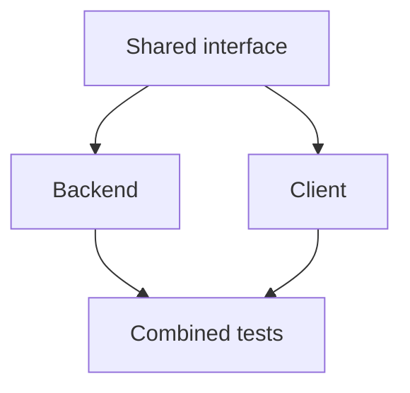

# Coordination preflight v0.1

**Status:** executable read-only local projection and shadow recommendation,
issue 915, under the existing Product Spine/C9/C10/connector owners.

[`idkmesh/coordination_preflight.py`](https://github.com/MSKazemi/idkmesh/blob/main/idkmesh/coordination_preflight.py)
implements the dependency and effort slice of the
[coordination plan](../planning/HUMAN_AGENT_COORDINATION_ALGORITHMS_2026-10-04.md).
It composes canonical WorkUnit source binding and `resolve_routes()` rather
than replacing either. The report recommends; it does not acquire a claim,
reserve a global resource, reveal credentials, start a worker, select a
candidate, verify, accept, or merge. Existing live issue routing is unchanged.

## Freeze the prerequisite graph

`DependencyGraph(scope, work_units, source_revisions=...)` accepts already
schema-valid WorkUnit v0.2 documents and exact trusted source revisions.
It checks the source declarations through `bind_work_unit_source()`, hashes
the complete WorkUnit, detaches mutable caller input and freezes its bindings,
WorkUnit risk floors, required edges and topology.
It is a semantic projection, not a replacement full WorkUnit/schema validator
or a producer of trusted SCM/authentication evidence.

Only `requires` is an executable prerequisite. WorkUnit -> prerequisite is the
canonical edge direction; the scheduler also builds prerequisite -> dependents
for readiness/ranking. `blocks`, `informs`, `validates` and `derived_from` remain
non-executable here. Required missing targets, duplicate edges and cycles fail
closed. Arbitrary nonempty `requires.condition` text is rejected rather than
interpreting "issue closed" or model prose as an acceptance condition.

Kahn's iterative topological traversal handles deep graphs without recursive
stack limits. Its graph traversal is `O(V+E)`; deterministic normalization adds
sorting cost and hashing costs the size of the input documents. This is not a
claim that every projection/routing operation has constant cost.



The combined test task waits for both branches. Completing only one branch
does not reduce a fan-in requirement to zero.

## Observe integrated prerequisites

`PrerequisiteObservation` binds tenant/project scope, event identity, a
per-WorkUnit source sequence, WorkUnit/source binding, state and input digest.
An `integrated` observation additionally requires exact integrated Git revision,
artifact digest, verification reference and integration-decision reference.
Candidate/pending/rejected observations do not satisfy a prerequisite.
An issue's closed state or a worker's success report is insufficient.

These are **trusted coordinator observations**. The library checks structural
and exact-binding consistency, not signatures, Git reachability, reviewer
independence, check outcomes, artifact bytes or the truth of an integration
reference. Trusted existing readers/verifiers/decision adapters must produce
these observations; accepting arbitrary client JSON would bypass that boundary.
The committed demo/tests use synthetic observations, not real integration.

`DependencyProjection.observe()` applies one event once. Exact replay is a
no-op; changed content under the same identity fails `event_conflict`. A
different event at the same WorkUnit sequence fails `sequence_conflict`; older
events cannot overwrite newer state. Wrong-scope/unknown-node events fail.
The default local replay budget is 10,000 distinct events; exhaustion fails
without applying another event. This is an in-memory projection: restart
requires replay from a separately retained trusted ledger, not process memory.

## Current inputs and descendant invalidation

`readiness()` recomputes prerequisite satisfaction from the current exact
snapshot instead of decrementing a counter on each delivered event. Each task
gets `ready`, `satisfied`, `inputs_digest` and explicit blockers. This costs
one graph traversal plus hashing its input pins and avoids double decrement
under event replay.

A prerequisite is satisfied only when its observation is integrated, its
WorkUnit/source binding matches, its own prerequisites are current, and its
observed input digest equals the currently computed input digest.
The latter check matters: a task integrated against old upstream artifacts
cannot silently justify new descendants.

Input digests bind scope, the complete task binding and direct prerequisites'
WorkUnit/source, integrated revision, artifact and input digests. Transitive
input changes therefore propagate. A graph digest binds the whole graph for
report replay, but is deliberately not part of every task's input digest;
editing an unrelated branch does not rebind all tasks. Delivery/sequence/ref
aliases do not change artifact input identity. A new current observation still
changes the report's observation snapshot digest.

After an upstream change, a directly dependent task may be ready to run again,
but its old integrated observation is not current. Its descendants wait until
new exact-input evidence is recorded. This projection does not erase old
evidence, cancel workers or revoke live grants by itself.

## Effort and capability recommendation

`EffortEstimate` records component count, ambiguity, coupling, execution seconds,
verification minutes, integration minutes, estimate source and whether a
maintained deterministic operation is known. Missing values are explicit.
Estimates are trusted declarations, **not calibrated success probabilities**.
Issue length, model confidence, provider brand and synthetic tests do not
establish real model skill.

The first shadow heuristic is intentionally inspectable:

| Declared shape | Suggested capability before trusted floor |
| --- | --- |
| Known deterministic operation, low ambiguity/coupling | T0 maintained tool |
| 1–2 components, low ambiguity/coupling, ordinary risk | T1 small |
| 3–7 components or medium ambiguity/coupling | At least T2 standard |
| 8+ components, high coupling or high risk | At least T3 strong |
| High ambiguity or critical risk | T4 peak |
| Unknown component/ambiguity/coupling requirements | Queue for clarification |

These cutoffs are local pilot choices; observed held-out comparison is required
before preferring this heuristic to the live issue router. A deterministic
operation still carries existing risk/authority/review requirements. The
trusted capability floor is never lowered. Effective risk is the greater of
the routing template and the frozen WorkUnit's security risk. Missing duration
does not fabricate a runtime; total duration remains unknown and critical-path
ranking abstains.

`coordination_preflight()` calls the existing connector resolver with that
conservative recommendation in **shadow mode**. The smallest eligible supported
tier is its existing lexicographic baseline. It preserves authority mode,
human gates, tools, risk, connector kind, processing, secrets and capacity
filters. An inconsistent non-T0 recommendation under deterministic authority
queues rather than changing that authority to permit an LLM.
Project spend is clamped to zero even if a task template permits payment.
No eligible zero-project-cost lane means queue, never a paid fallback.

Blocked, already integrated or unclear tasks have no selected recommendation.
The report shows eligible/rejected lanes and reasons, but `ready` is a
dependency fact, not dispatch authority. A human-required task remains
human-required even when a T4 connector is configured.

## Priority and uncertainty

`critical_path_ranks()` uses a HEFT-inspired baseline with zero edge delay:

```text
duration(u) = execution_seconds + 60 * (verification_minutes + integration_minutes)
rank(u) = duration(u) + max rank(v) over dependents v, or zero for the max at a leaf
```

All terms are seconds. Missing duration causes `duration_unknown`; ranks do not
invent precision. This estimates remaining chain duration, not optimal global
scheduling. It does not model heterogeneous finish times, network delay,
fairness/aging, donor energy, quota shadow prices, learned routing or verification
backpressure. Those comparisons remain under the research/operational owners.

## Reproduce and integrate later

```bash
python examples/coordination/preflight_demo.py
python -m pytest -q tests/test_coordination_preflight.py
```

The standalone stdlib demo emits three schema-conforming reports:

| Scenario | Dependency ready | Recommended lane |
| --- | --- | --- |
| Required research input missing | false | none |
| Synthetic integrated input; simple declared work | true | `small-demo` (T1) |
| Same input; substantial coupled work | true | `strong-demo` (T3) |

The wrapper labels the demonstration `synthetic_fixture`; it executes no model
or worker and establishes no real quality/performance advantage. The report
contract is [`coordination-preflight-v0.1.schema.json`](https://github.com/MSKazemi/idkmesh/blob/main/schemas/coordination-preflight-v0.1.schema.json).

A future executor must recheck these exact inputs and authority inside its
authoritative admission boundary, bind the input digest to
[Local Task Claims](LOCAL_TASK_CLAIMS_V0_1.md), and acquire resource reservations
before dispatch. It must also revalidate at canonical submission/integration
when upstream inputs change. Running a report and later claiming without that
recheck would leave a time-of-check/time-of-use race. No live scheduler or
production readiness guarantee is supplied by this read-only slice.
