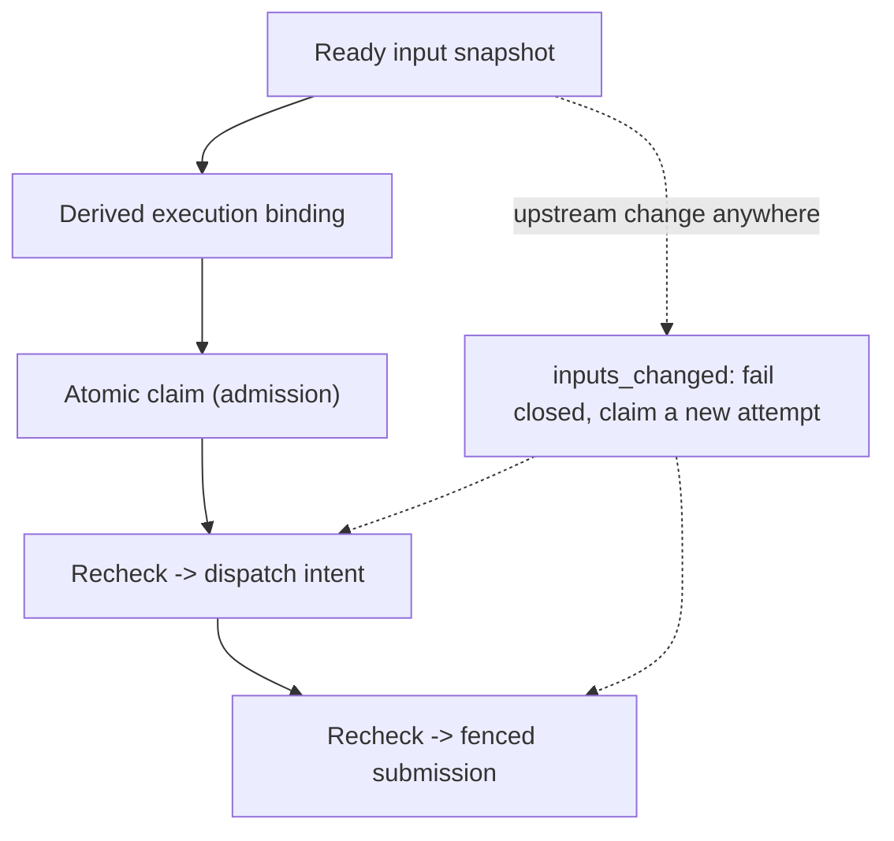

# Executor admission v0.1

**Status:** executable local composition of readiness and claims, issue 921,
under the existing Product Spine/C9/C10/connector owners.

[`idkmesh/executor_admission.py`](https://github.com/MSKazemi/idkmesh/blob/main/idkmesh/executor_admission.py) closes
the check/use race named by [Coordination Preflight v0.1](COORDINATION_PREFLIGHT_V0_1.md):
a read-only readiness report does not authorize external work. It composes the
preflight's exact-input readiness projection with
[Local Task Claims v0.1](LOCAL_TASK_CLAIMS_V0_1.md) so that readiness, the
derived execution binding and the atomic claim are captured in one operation
before any external dispatch intent exists, and the same exact input snapshot
is checked again at canonical candidate submission.

## One operation: readiness, binding, claim

`ExecutorAdmission.admit(node, task, actor, request_id=...)` performs, under
one local lock and one claims transaction:

1. readiness is recomputed from the current observation snapshot;
2. the execution binding is derived — never supplied — from the frozen
   WorkUnit/source binding and the ready-state `inputs_digest`;
3. the claim is acquired through `LocalTaskClaims.claim()`.

Blocked tasks fail `task_not_ready` with their blocker list, already
integrated tasks fail `task_already_integrated`, unknown nodes fail
`unknown_work_unit`, and a task without a trusted claim policy fails through
the existing `task_not_configured`. None of these refusals create a claim
record. Exact admission replay returns the retained grant without renewal or a
second attempt, as in the claims layer.

The **logical task identity** stays a caller-supplied scoped task reference,
separate from the execution binding, exactly as the coordination plan requires:
a task identity survives a rebase, and duplicate work resolves to one identity
through an explicit alias decision, not through a hash. The gate checks only
that the reference is a scoped `task` in the graph's tenant/project scope
(`invalid_input` / `scope_mismatch`); it does not invent an identity policy.

## Recheck before external work and at submission

Two later phases revalidate the admission-time snapshot before touching
canonical claim state:

| Phase | Operation | On unchanged inputs | On changed inputs |
| --- | --- | --- | --- |
| `reserve_execution` | retain the UNKNOWN external dispatch intent | existing `reserve_dispatch` semantics; replay never authorizes a retry | `inputs_changed`, nothing written |
| `submit` | fence the candidate artifact digest | existing `record_submission` semantics; same digest replay is idempotent | `inputs_changed`, no submission digest written |

`inputs_changed` covers both "the task is blocked again" and "ready, but the
exact input digest moved". A claim whose WorkUnit digest or source revision
does not match the node asked about fails `binding_mismatch`, so one logical
task cannot silently submit work derived from a different execution binding.
Unrelated graph branches do not rebind a task, so their movement leaves an
admission current — the preflight's input-digest semantics, enforced at the
canonical write points.

Owner lifecycle operations (acknowledge, renew, progress, release) and trusted
execution reconciliation stay on `LocalTaskClaims`. Stale epochs, non-owners
and unknown request identities keep failing through the existing fencing codes
(`stale_claim`, `claim_owner_denied`, `claim_not_found`); this gate adds no
clock, occupancy or retry semantics.



## Atomicity boundary

Prerequisite observations must be applied through
`ExecutorAdmission.observe()`, which shares the admission lock. Within one
process this makes "readiness snapshot + claim" one atomic step against
concurrent observation delivery. Direct mutation of the projection is not
prevented; it is still fail-closed at both recheck points (covered by tests),
and an admission caught mid-mutation has its fresh grant withdrawn rather than
left holding the slot.

This is a **local conformance adapter**, not a distributed transaction. It
does not coordinate separate processes against one projection (the projection
is in-memory), does not authenticate observation producers, and does not make
an external provider exactly-once. Durable multi-process admission remains the
claims store's SQLite transaction; global resource reservations, the GitHub
durable ledger and provider-session reconciliation remain open work under the
existing owners.

## Report contract

Each phase returns a versioned record,
[`executor-admission-v0.1.schema.json`](https://github.com/MSKazemi/idkmesh/blob/main/schemas/executor-admission-v0.1.schema.json),
binding scope, graph digest, observation digest, WorkUnit binding, input
digest, `created`, and the embedded claim snapshot (identical in shape to
`task-claim-v0.1`). The report is metadata; the durable claim record is the
admission. Its `authority` block is an all-false ceiling: the record grants no
dispatch credential, worker execution, candidate acceptance or merge.

## Reproduce and integrate later

```bash
python examples/coordination/admission_demo.py
python -m pytest -q tests/test_executor_admission.py
```

The standalone stdlib demo uses the existing composability fixtures with
explicitly synthetic identities and observations:

| Scenario | Outcome |
| --- | --- |
| Admit coding before its required research input is integrated | `task_not_ready`; no claim |
| Research integrated; admit coding | admission report bound to the exact ready inputs |
| Acknowledge, reserve execution, submit candidate | reservation and submission reports; fenced digest |
| Research re-integrated with new artifacts; submit again | `inputs_changed`; no second submission |

The demo labels its evidence `synthetic_fixture`; no model, provider, worker,
verification or integration runs. The gate itself is not wired into
`local_agent_runner`, the Jules dispatcher, the Product Spine dispatch path or
any live provider. Doing so requires the executor to call these phases around
its real external effects and to feed observations from trusted adapters.

Remaining evidence gates are unchanged: authenticated event/identity
producers, the GitHub durable ledger, real provider termination/recovery,
end-to-end wiring, a genuine two-user pilot, and held-out model-routing
quality/energy/attention comparisons. A report alone remains a report; only
the claim record admits registered work.
